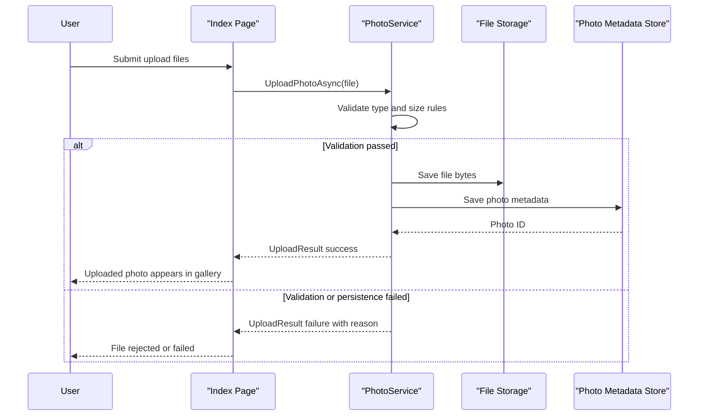

# Core Business Workflows

PhotoAlbum supports the end-user workflow of uploading, browsing, viewing, and deleting photos in a personal gallery. Business logic centers on file validation, metadata persistence, and consistency between file storage and database state.

## Domain Entities

| Entity | Service / Bounded Context | Description | Key Relationships |
|---|---|---|---|
| Photo | Photo Management | Represents one uploaded image and its display metadata | Used by gallery listing, detail view, and file serving flows |
| UploadResult | Photo Management | Outcome contract for each upload attempt | Connects validation/persistence outcomes back to UI |

## Service-to-Domain Mapping

| Service | Domain Context | Owned Entities | External Dependencies |
|---|---|---|---|
| Razor Page Models (`Index`, `Detail`, `PhotoFile`) | User Interaction | Uses `Photo`, `UploadResult` via service | Depends on `IPhotoService` |
| `PhotoService` | Photo Management | Owns lifecycle rules for `Photo` and `UploadResult` | SQL Server via EF Core, local upload directory |

## Primary Workflows

### Workflow 1: Upload Photos to Gallery

1. User submits one or more files to `POST /?handler=Upload`.
2. Each file is validated for MIME type, size, and non-empty content.
3. Service creates a unique stored filename and writes the binary to upload storage.
4. Service persists `Photo` metadata to database.
5. On DB failure, service attempts file rollback (delete written file).
6. UI receives success/failed lists and updates gallery.

### Workflow 2: View and Navigate Photo Details

1. User opens `/Detail?id={id}`.
2. Service returns all photos sorted by upload time.
3. Page model selects current photo and computes previous/next navigation IDs.
4. User can request image bytes through `/PhotoFile?id={id}`.

### Workflow 3: Delete Photo

1. User posts to `/Detail?handler=Delete&id={id}`.
2. Service loads metadata, deletes file when present, then removes DB record.
3. User is redirected to gallery; failures surface a friendly error.

## Cross-Service Data Flows

The app is single-service with no remote microservice aggregation. Data composition is internal: page handlers combine metadata from SQL Server with file availability from local storage to produce gallery/detail responses.

## Business Workflow Sequence

## Business Rules & Decision Logic

- Allowed formats are image/jpeg, image/png, image/gif, and image/webp.
- Maximum upload size is governed by `FileUpload:MaxFileSizeBytes` (default 10 MB).
- Empty files are rejected.
- Successful upload requires both file-system write and database metadata save.
- If metadata save fails, file rollback is attempted to maintain consistency.
- Delete operation prioritizes metadata consistency: DB record removal proceeds even when physical file deletion logs an error.
