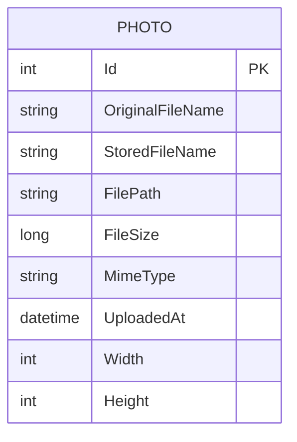

# Data Architecture & Persistence Layer

The data layer is centered on a single EF Core `DbContext` with one primary entity (`Photo`) stored in SQL Server, while binary image content is stored on disk. Persistence behavior is simple and strongly aligned to gallery CRUD workflows.

## Database Configuration

| Service/Module | DB Type | Profile | Driver | Connection | Migration Tool |
|---|---|---|---|---|---|
| PhotoAlbum | SQL Server (LocalDB by default) | Default / Development | Microsoft.EntityFrameworkCore.SqlServer | `DefaultConnection` from appsettings/user secrets | EF Core migrations (`Database.MigrateAsync`) |
| PhotoAlbum.Tests | In-memory provider | Test | Microsoft.EntityFrameworkCore.InMemory | In-memory database per test run | None |

## Data Ownership per Service

| Service | Tables Owned | ORM Framework | Caching | Notes |
|---|---|---|---|---|
| PhotoAlbum | `Photos` | EF Core 9 | No entity/query cache configured | Owns all metadata for uploaded photos |

## Entity Model

## Key Repository Methods

| Service | Repository | Notable Methods | Purpose |
|---|---|---|---|
| PhotoAlbum | `PhotoAlbumContext` via `PhotoService` | `Photos.OrderByDescending(...).ToListAsync()` | Load gallery photos newest-first |
| PhotoAlbum | `PhotoAlbumContext` via `PhotoService` | `Photos.FindAsync(id)` | Retrieve one photo for display/file serving/delete |
| PhotoAlbum | `PhotoAlbumContext` via `PhotoService` | `Photos.AddAsync(photo)` + `SaveChangesAsync()` | Persist uploaded photo metadata |
| PhotoAlbum | `PhotoAlbumContext` via `PhotoService` | `Photos.Remove(photo)` + `SaveChangesAsync()` | Delete metadata after file deletion |

## Caching Strategy

No distributed or in-memory application cache provider is configured for domain data. The app uses HTTP cache headers for static content and file responses (`Cache-Control` and `ETag`) to reduce repeated client downloads.

## Data Ownership Boundaries

This is a single-service monolith with one logical data owner. The application writes and reads photo metadata from SQL Server and stores physical files in local storage; there are no cross-service joins, shared schemas with other services, or CQRS read models.

### Data Classification & Sensitivity

| Entity | Sensitive Fields | Classification (PII/PHI/PCI/None) | Controls in Place |
|---|---|---|---|
| Photo | File names may contain user-originated naming context | PII (low) | No explicit encryption-at-rest or data masking configuration in code |

