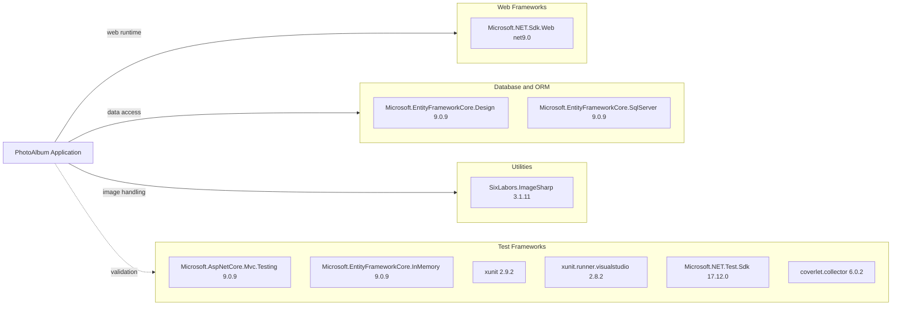

# Dependency Map

This .NET solution declares a focused dependency set centered on web hosting, EF Core persistence, image processing, and test infrastructure.

## Dependencies

### Dependency Summary

| Category | Count | Key Libraries | Notes |
|---|---:|---|---|
| Web Frameworks | 1 | Microsoft.NET.Sdk.Web | ASP.NET Core Razor Pages application |
| Database / ORM | 2 | EF Core Design, EF Core SQL Server | SQL Server-backed metadata persistence |
| Utilities | 1 | SixLabors.ImageSharp | Image metadata extraction |

### Version & Compatibility Risks

The application targets `net9.0`, which is relatively recent. Upgrade risk is moderate around EF Core provider compatibility and any behavioral changes in future target frameworks, which is why the dedicated upgrade assessment is run separately.

### Notable Observations

- Production dependency footprint is intentionally small and mostly Microsoft platform libraries.
- EF Core Design is marked with `PrivateAssets=all`, avoiding runtime deployment impact.
- ImageSharp introduces native image parsing paths that should be retained in security validation.

## Test Dependencies

| Framework | Version | Notes |
|---|---|---|
| xUnit | 2.9.2 | Unit testing framework |
| xunit.runner.visualstudio | 2.8.2 | IDE/CLI test runner support |
| Microsoft.NET.Test.Sdk | 17.12.0 | Test host infrastructure |
| Microsoft.AspNetCore.Mvc.Testing | 9.0.9 | Web integration test support |
| Microsoft.EntityFrameworkCore.InMemory | 9.0.9 | In-memory test database provider |
| coverlet.collector | 6.0.2 | Coverage collection |

Total test-scope dependencies: 6

The test stack is standard for ASP.NET Core and already covers service behavior with in-memory EF Core.
