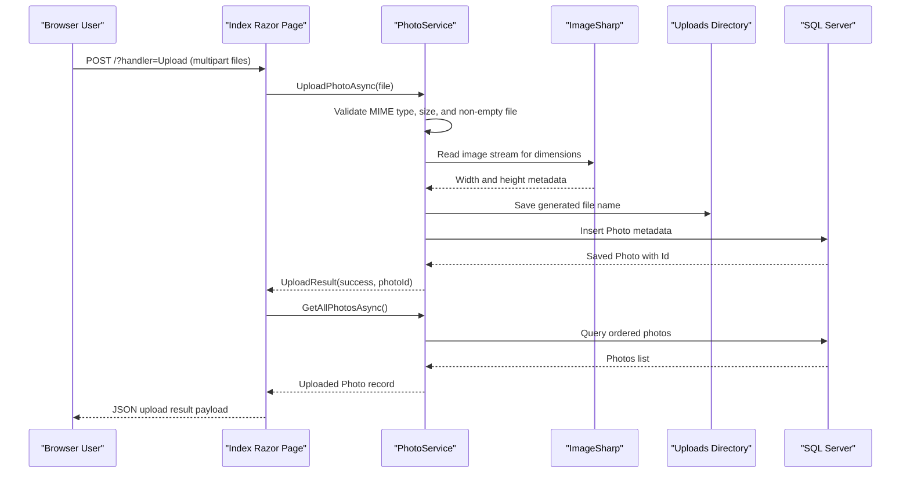

# API & Service Communication Contracts

PhotoAlbum exposes a small browser-facing surface built with Razor Pages rather than a standalone JSON API. Communication is entirely synchronous and remains inside a single deployable web service.

## Service Catalog

| Service | Port | Category | Purpose |
|---|---|---|---|
| `PhotoAlbum` web app | `5134` (HTTP dev), `7055` (HTTPS dev), `8080` (container) | API Layer | Serves gallery pages, accepts uploads, streams images, and deletes photos |

## API Endpoints Inventory

| Service | Method | Path | Request Type | Response Type |
|---|---|---|---|---|
| `PhotoAlbum` | GET | `/` | None | Razor Page containing gallery view model (`List<Photo>`) |
| `PhotoAlbum` | POST | `/?handler=Upload` | Multipart form body with `List<IFormFile>` | JSON payload with `uploadedPhotos[]` and `failedUploads[]` |
| `PhotoAlbum` | GET | `/Detail?id={id}` | Query parameter `id` | Razor Page for a single `Photo` plus previous/next navigation IDs |
| `PhotoAlbum` | POST | `/Detail?handler=Delete&id={id}` | Form/query parameter `id` | Redirect to `/Index` or back to `/Detail` on failure |
| `PhotoAlbum` | GET | `/PhotoFile?id={id}` | Query parameter `id` | Binary file response with `photo.MimeType` content type |
| `PhotoAlbum` | GET | `/Privacy` | None | Static Razor Page |

## Management & Observability Endpoints

| Service | Endpoint | Custom Metrics (if any) |
|---|---|---|
| `PhotoAlbum` | None detected | No custom health, metrics, or Swagger endpoints detected |

## DTOs & Contracts

The application uses a small set of in-process contract types. `Photo` acts as the primary response/view model for gallery and detail pages, while `UploadResult` is the service-level result contract that captures success, generated identifier, original filename, and any user-facing error message. Upload requests arrive as ASP.NET Core `IFormFile` instances rather than a custom request DTO. The upload handler returns anonymous JSON objects for `uploadedPhotos` and `failedUploads`, so there is no generated OpenAPI or strongly typed API schema in the repository. Serialization is provided by the default ASP.NET Core JSON stack.

## Communication Patterns

All communication is synchronous: browser requests are routed to Razor Page handlers, which delegate to `PhotoService`, which in turn performs EF Core database operations and filesystem access. There is no asynchronous messaging, no service discovery, no API gateway, and no circuit breaker or retry library configured. Startup order matters only inside the single process because the app ensures the uploads directory exists and then applies database migrations before serving requests. Security posture is minimal: HTTPS redirection is enabled, but no authentication, authorization policy, JWT handling, or role checks are configured, so application endpoints are effectively public.

## Service Technology Matrix

| Service | Web | Data Access | Discovery | Gateway | Actuator | Cache | Metrics |
|---|---|---|---|---|---|---|---|
| `PhotoAlbum` | Razor Pages | EF Core SqlServer | None | None | None | HTTP cache headers only | None |

## Service Communication Sequence

