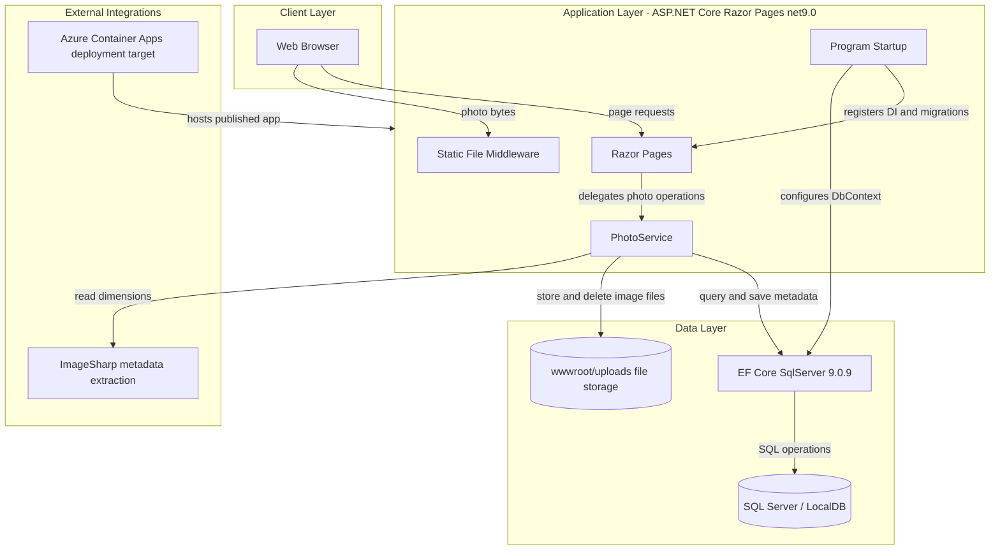
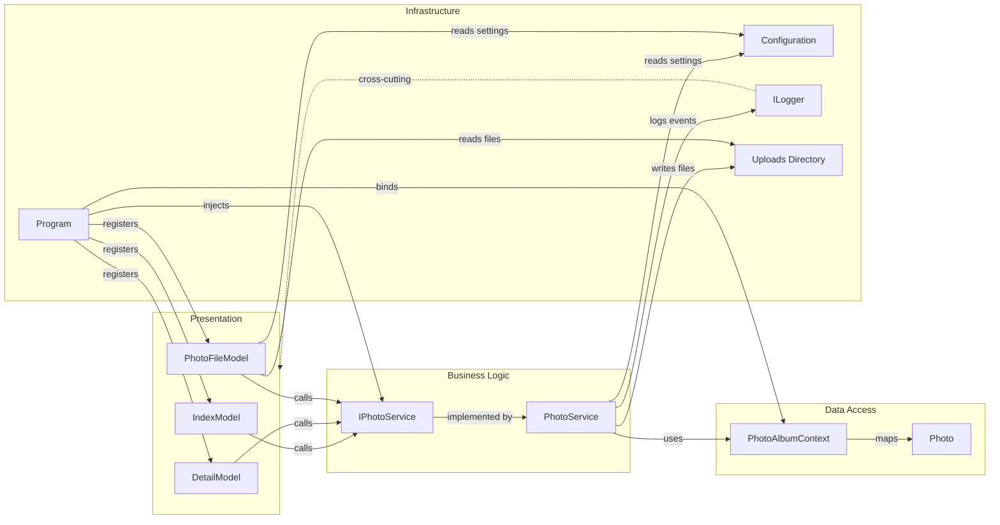

# Architecture Diagram

This document summarizes the PhotoAlbum application as a single ASP.NET Core web workload with EF Core persistence and filesystem-backed image storage. It highlights both the high-level runtime architecture and the key in-process component relationships.

## Application Architecture

### Technology Stack Summary

| Layer | Technology | Version | Purpose |
|---|---|---|---|
| Presentation | ASP.NET Core Razor Pages | net9.0 | Server-rendered web UI and handler endpoints |
| Application | Dependency Injection + logging | ASP.NET Core built-in | Composes page models, services, and diagnostics |
| Business Logic | `PhotoService` | Application code | Upload validation, metadata persistence, delete flow |
| Data Access | Entity Framework Core SqlServer | 9.0.9 | Database access and schema migrations |
| Storage | SQL Server / LocalDB | Configured via connection string | Stores photo metadata |
| Object Storage | Local filesystem under `wwwroot/uploads` | N/A | Stores uploaded image binaries |
| Imaging | SixLabors.ImageSharp | 3.1.11 | Extracts width and height metadata |

### Data Storage & External Services

The application stores photo metadata in a SQL Server-compatible database and stores the actual uploaded image files on the local application filesystem under `wwwroot/uploads`. There is no message broker, cache server, or third-party API integration in the current codebase; Azure Container Apps and Bicep files indicate a cloud deployment target rather than a runtime service dependency.

### Key Architectural Decisions

- Uses a single deployable web application rather than splitting UI, API, and worker responsibilities into separate services.
- Keeps binary image content on disk while persisting only metadata in SQL Server, which simplifies the domain model but couples the app to writable local storage.
- Applies EF Core migrations automatically during startup, making database readiness a hard prerequisite for successful boot.

## Component Relationships

### Component Inventory

| Component | Layer | Type | Responsibility |
|---|---|---|---|
| `Program` | Infrastructure | Startup composition root | Registers Razor Pages, EF Core, form limits, and startup migrations |
| `IndexModel` | Presentation | Razor Page model | Loads gallery data and handles upload submissions |
| `DetailModel` | Presentation | Razor Page model | Shows a single photo and handles delete requests |
| `PhotoFileModel` | Presentation | Razor Page model | Streams stored image bytes to the browser |
| `IPhotoService` | Business Logic | Service contract | Defines photo retrieval, upload, and delete operations |
| `PhotoService` | Business Logic | Application service | Validates uploads, extracts metadata, persists records, deletes files |
| `PhotoAlbumContext` | Data Access | EF Core `DbContext` | Manages the `Photos` table and schema configuration |
| `Photo` | Data Access | Entity | Represents persisted photo metadata |
