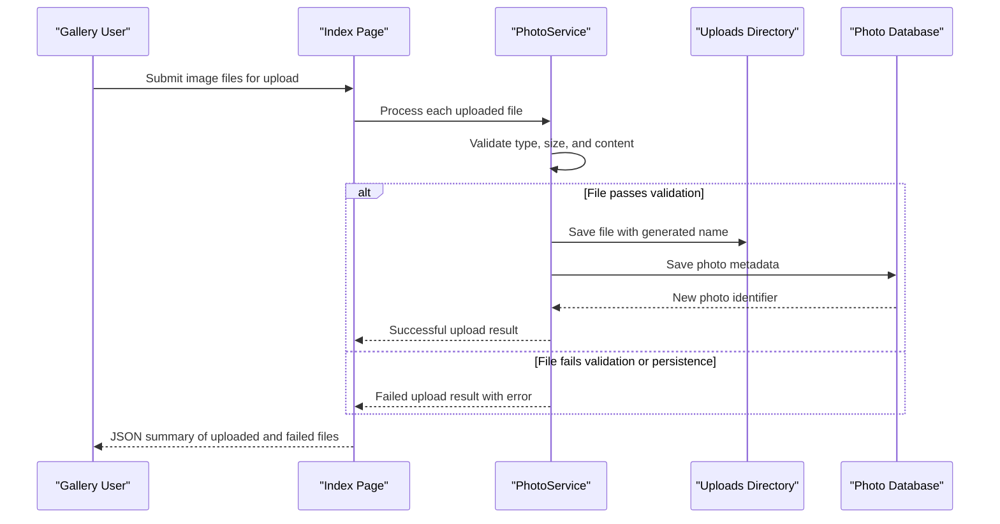

# Core Business Workflows

PhotoAlbum lets end users upload, browse, view, and delete image files through a simple web gallery experience. The core business behavior centers on validating uploads, preserving photo metadata, and keeping database records synchronized with image files on disk.

## Domain Entities

| Entity | Service / Bounded Context | Description | Key Relationships |
|---|---|---|---|
| `Photo` | Photo gallery management | Canonical record for an uploaded image and its display metadata | Referenced by gallery, detail, file-serving, and delete workflows |
| `UploadResult` | Upload processing | Service result describing whether an upload succeeded and why | Produced during upload workflow and transformed into JSON response |

## Service-to-Domain Mapping

| Service | Domain Context | Owned Entities | External Dependencies |
|---|---|---|---|
| `PhotoAlbum` | Photo gallery and media management | `Photo`, `UploadResult` | SQL Server metadata store, local upload directory, ImageSharp |

## Primary Workflows

### Workflow 1: Upload photos to the gallery

A user submits one or more files to the upload handler on the index page. The page model iterates each file, and `PhotoService` validates MIME type, file size, and non-empty content before generating a unique stored filename. The service attempts to read image dimensions, writes the file to disk, persists a `Photo` record, and returns success or failure details for each file so the UI can present mixed-result uploads.

### Workflow 2: Browse and inspect uploaded photos

The gallery page loads all photos ordered by newest first and renders them for browsing. When a user opens a detail page, the app loads the selected `Photo`, computes previous and next navigation IDs from the ordered list, and then allows the browser to fetch the actual binary payload through the indirect `/PhotoFile` handler.

### Workflow 3: Delete a photo

A delete action on the detail page triggers `PhotoService.DeletePhotoAsync`. The service looks up the photo record, attempts to remove the backing file from disk, and then removes the database record. If filesystem cleanup fails, the workflow still proceeds with metadata deletion while logging the operational problem.

## Cross-Service Data Flows

There are no cross-service or cross-bounded-context integrations in the current implementation. All business data composition happens inside the single web application, where page models combine `PhotoService` results with Razor Page rendering. The only multi-store coordination is between the SQL metadata store and the uploads directory on the local filesystem.

## Business Workflow Sequence

## Business Rules & Decision Logic

- Only JPEG, PNG, GIF, and WebP files are accepted.
- A file must be non-empty and must not exceed the configured 10 MB maximum size.
- Each stored file name is replaced with a GUID-based name to avoid collisions in the uploads directory.
- A successful upload requires both disk persistence and database persistence; if the database save fails after the file write, the service attempts to delete the newly written file as rollback.
- Gallery ordering is reverse chronological based on upload timestamp.
- Delete operations continue with metadata removal even if disk deletion fails, prioritizing logical cleanup while logging the inconsistency.
- There are no business-level authorization rules in the current code, so all gallery actions are available to any caller who can reach the site.
