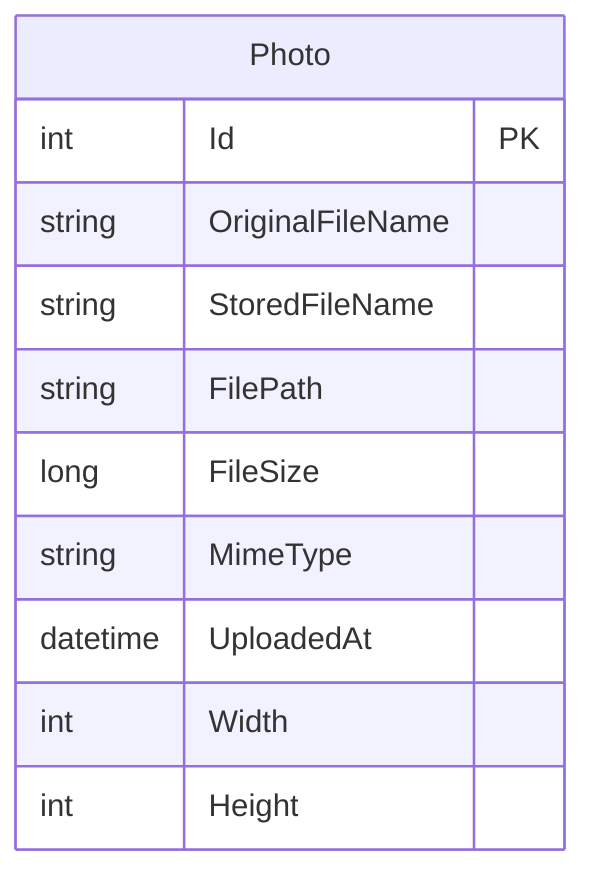

# Data Architecture & Persistence Layer

PhotoAlbum has a compact data layer centered on one EF Core entity and one SQL-backed table, with image binaries stored separately on disk. Persistence concerns are handled directly in the web application through `PhotoAlbumContext` and `PhotoService`.

## Database Configuration

| Service/Module | DB Type | Profile | Driver | Connection | Migration Tool |
|---|---|---|---|---|---|
| `PhotoAlbum` | SQL Server / LocalDB | Default | `Microsoft.EntityFrameworkCore.SqlServer` | `DefaultConnection` points to `(localdb)\mssqllocaldb` by default | EF Core migrations applied at startup |
| `PhotoAlbum` | SQL Server / environment override | Development / deployed environments | `Microsoft.EntityFrameworkCore.SqlServer` | Connection string can be overridden via environment or secret configuration | EF Core migrations applied at startup |

## Data Ownership per Service

| Service | Tables Owned | ORM Framework | Caching | Notes |
|---|---|---|---|---|
| `PhotoAlbum` | `Photos` | EF Core 9 with `DbContext` | None at data layer | Binary image files are stored outside the database in `wwwroot/uploads` |

## Entity Model

The single persisted entity is defined in `/PhotoAlbum/Models/Photo.cs` and configured in `/PhotoAlbum/Data/PhotoAlbumContext.cs`. The initial migration creates one `Photos` table with an index on `UploadedAt` to support reverse chronological gallery queries.

## Key Repository Methods

| Service | Repository | Notable Methods | Purpose |
|---|---|---|---|
| `PhotoAlbum` | `PhotoAlbumContext` / `DbSet<Photo>` | `OrderByDescending(p => p.UploadedAt).ToListAsync()` | Returns gallery results with newest photos first |
| `PhotoAlbum` | `PhotoAlbumContext` / `DbSet<Photo>` | `FindAsync(id)` | Loads a single photo for detail and file-serving flows |
| `PhotoAlbum` | `PhotoAlbumContext` / `DbSet<Photo>` | `AddAsync(photo)` + `SaveChangesAsync()` | Persists uploaded photo metadata |
| `PhotoAlbum` | `PhotoAlbumContext` / `DbSet<Photo>` | `Remove(photo)` + `SaveChangesAsync()` | Deletes metadata after a user removes a photo |

## Caching Strategy

No dedicated application cache provider is configured. The closest caching behavior is HTTP-level caching: static assets receive a one-hour `Cache-Control` header, and the indirect photo file endpoint sets a long-lived cache header plus an `ETag` based on photo ID and upload timestamp. The persistence layer itself does not use Redis, in-memory query caching, or EF Core second-level caching.

## Data Ownership Boundaries

The system is a single-service application with one logical owner for all persisted data. Photo metadata lives in a single SQL database, while the actual image bytes live on the application filesystem; `PhotoService` coordinates both stores within one request flow. There is no cross-service access pattern, CQRS split, or shared-database integration with other applications.

### Data Classification & Sensitivity

| Entity | Sensitive Fields | Classification (PII/PHI/PCI/None) | Controls in Place |
|---|---|---|---|
| `Photo` | `OriginalFileName`, uploaded image reference metadata | None | No field-level masking or encryption configured in code; relies on platform storage controls |

The entity model itself does not contain obvious PII, PHI, or PCI fields such as names, addresses, or payment data. Uploaded image binaries stored on disk may still contain user content, but that content is external to the EF Core entity model documented here.
