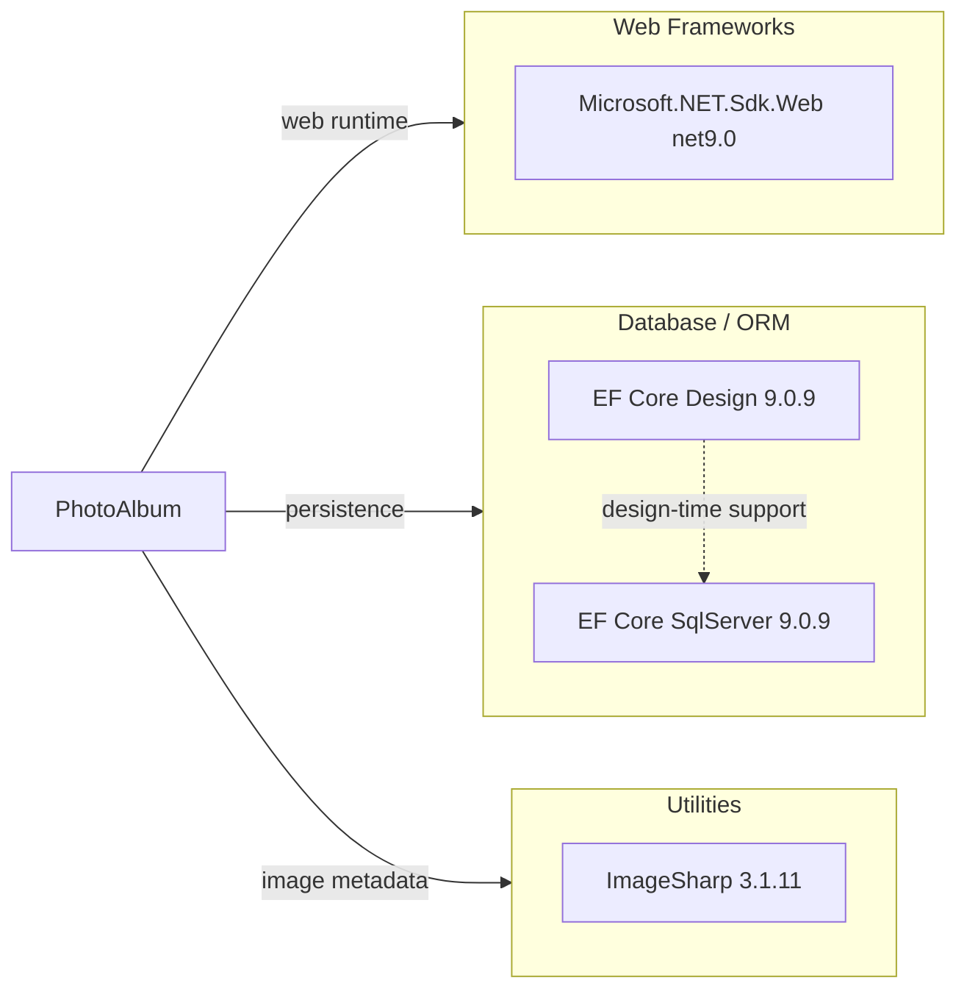

# Dependency Map

This project is a small ASP.NET Core web application with 3 declared production package dependencies plus the implicit .NET web framework and 6 test-only dependencies. The map below groups the declared dependencies by their modernization-relevant function.

## Dependencies

### Dependency Summary

| Category | Count | Key Libraries | Notes |
|---|---|---|---|
| Web Frameworks | 1 | Microsoft.NET.Sdk.Web net9.0 | Brings in ASP.NET Core Razor Pages and hosting infrastructure |
| Database / ORM | 2 | Microsoft.EntityFrameworkCore.SqlServer 9.0.9, Microsoft.EntityFrameworkCore.Design 9.0.9 | SQL Server provider plus design-time tooling for migrations |
| Utilities | 1 | SixLabors.ImageSharp 3.1.11 | Used to inspect uploaded images and capture width/height |

### Version & Compatibility Risks

The application targets `.NET 9`, which is a short-term support release and already has a direct upgrade path to `net10.0`. The persistence layer is tightly coupled to SQL Server via `Microsoft.EntityFrameworkCore.SqlServer`, so any future database portability work will require provider-specific changes. Local filesystem storage for uploads is also an architectural portability concern even though it is not a NuGet dependency.

### Notable Observations

- There are no dedicated security, observability, caching, or messaging libraries declared; the app relies mostly on the ASP.NET Core platform defaults.
- `Microsoft.EntityFrameworkCore.Design` is marked private-assets-only, so it affects development and migration workflows but not the published runtime footprint.
- The production dependency surface is intentionally small, which should simplify modernization and dependency health review.

## Test Dependencies

| Framework | Version | Notes |
|---|---|---|
| xUnit | 2.9.2 | Primary unit test framework |
| xUnit runner Visual Studio | 2.8.2 | Test discovery and execution adapter |
| Microsoft.NET.Test.Sdk | 17.12.0 | .NET test host integration |
| Microsoft.AspNetCore.Mvc.Testing | 9.0.9 | Web app integration testing support |
| Microsoft.EntityFrameworkCore.InMemory | 9.0.9 | In-memory database for tests |
| coverlet.collector | 6.0.2 | Code coverage collection |

Total test-scope dependencies: 6

The test infrastructure is conventional for ASP.NET Core and includes both in-memory EF Core support and web-host testing support. No specialized browser automation or contract-testing library is present in the current test project.
