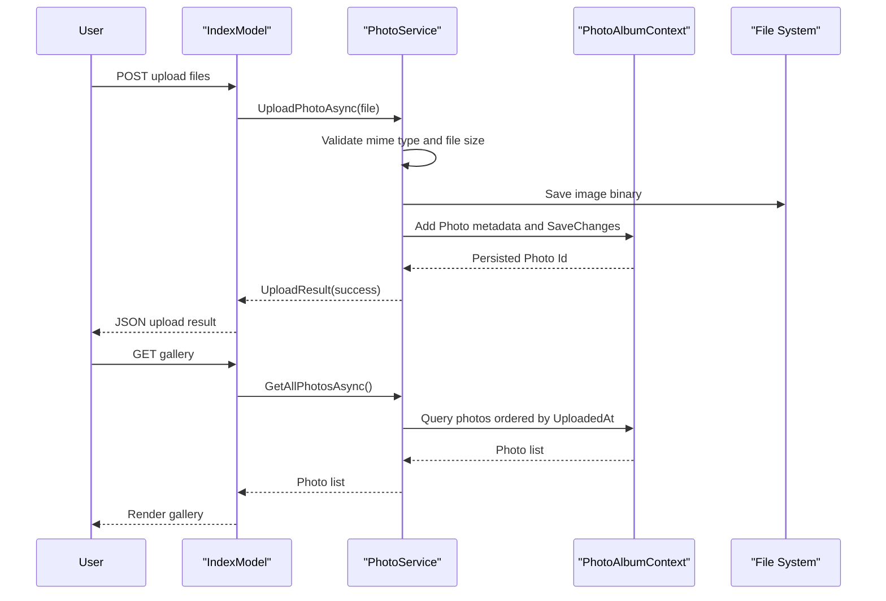

# API & Service Communication Contracts

PhotoAlbum exposes a small HTTP surface through Razor Page handlers for gallery browsing, upload, file retrieval, and delete operations. Communication is synchronous in-process calls from page handlers into a scoped service and then to EF Core/local storage.

## Service Catalog

| Service | Port | Category | Purpose |
|---|---|---|---|
| PhotoAlbum Web App | ASP.NET default (configured by host) | API Layer | Hosts Razor Pages and file upload workflows |

## API Endpoints Inventory

| Service | Method | Path | Request Type | Response Type |
|---|---|---|---|---|
| PhotoAlbum Web App | GET | /Index | Query only | HTML page with gallery model |
| PhotoAlbum Web App | POST | /Index?handler=Upload | Multipart form data `List<IFormFile>` | JSON upload result payload |
| PhotoAlbum Web App | GET | /Detail?id={id} | Path/query id | HTML detail page or 404 |
| PhotoAlbum Web App | POST | /Detail?handler=Delete&id={id} | Form post id | Redirect to Index or detail with error |
| PhotoAlbum Web App | GET | /PhotoFile?id={id} | Query id | Binary file stream with image MIME type |

## Management & Observability Endpoints

| Service | Endpoint | Custom Metrics (if any) |
|---|---|---|
| PhotoAlbum Web App | Not explicitly configured | None detected |

## DTOs & Contracts

The API contract is primarily page-model driven. `Photo` is used as response model data for page rendering and file lookup. Upload responses use anonymous JSON contract structures containing success flags, uploaded item details, and failed upload errors. `UploadResult` acts as a service-level transfer model between page handlers and the service layer.

## Communication Patterns

All communication is synchronous and local: Razor Page handlers call `IPhotoService`, which interacts with EF Core (`PhotoAlbumContext`) and filesystem APIs. No message broker, async pub/sub, service discovery, gateway, or client-side load-balancing is configured. No explicit retry/circuit-breaker policy is configured. Security posture is minimal by default app pipeline: no explicit API authentication/authorization policies are configured on page handlers.

## Service Technology Matrix

| Service | Web | Data Access | Discovery | Gateway | Actuator | Cache | Metrics |
|---|---|---|---|---|---|---|---|
| PhotoAlbum Web App | Razor Pages | EF Core SQL Server + file system | None | None | None | None | Built-in logging only |

## Service Communication Sequence

