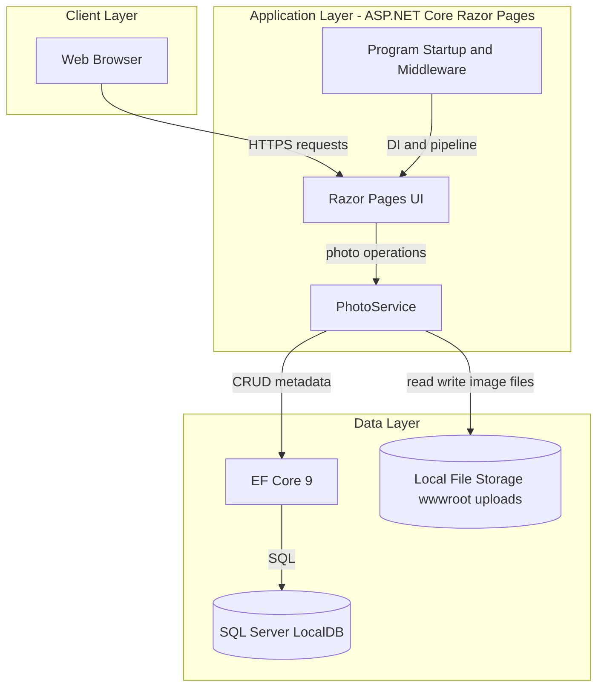
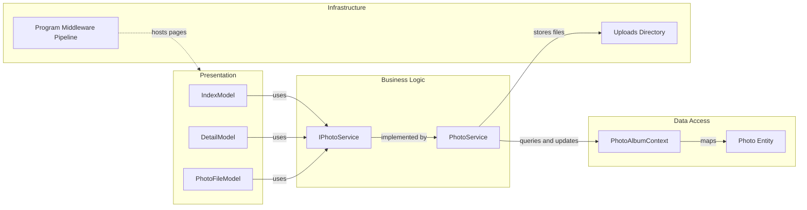

# Architecture Diagram

This document summarizes the PhotoAlbum application architecture and the core runtime component relationships.

## Application Architecture

### Technology Stack Summary

| Layer | Technology | Version | Purpose |
|---|---|---|---|
| Presentation | ASP.NET Core Razor Pages | 9.0 | Server-rendered gallery UI |
| Application | PhotoService | N/A | Upload, retrieval, delete business logic |
| Data Access | Entity Framework Core SQL Server | 9.0.9 | Persist photo metadata |
| Storage | SQL Server LocalDB + file system | LocalDB + local disk | Store metadata and image binaries |

### Data Storage & External Services

The app stores photo metadata in SQL Server LocalDB via EF Core and stores uploaded image files on the local file system under `wwwroot/uploads`. No external API, queue, or third-party service dependency is configured in the runtime path.

### Key Architectural Decisions

- Uses a service-layer abstraction (`IPhotoService`) between Razor Pages and persistence.
- Uses dual persistence (database metadata plus file-system binary storage) with rollback on DB failure.
- Applies startup migration and upload-folder initialization in `Program.cs`.

## Component Relationships

### Component Inventory

| Component | Layer | Type | Responsibility |
|---|---|---|---|
| IndexModel | Presentation | Razor PageModel | Loads gallery and handles uploads |
| DetailModel | Presentation | Razor PageModel | Shows single-photo view and deletion |
| PhotoFileModel | Presentation | Razor PageModel | Serves binary photo file by id |
| IPhotoService | Business Logic | Service contract | Defines photo operations |
| PhotoService | Business Logic | Service implementation | Validates uploads and coordinates DB/file operations |
| PhotoAlbumContext | Data Access | DbContext | EF Core unit of work for photos |
| Photo | Data Access | Entity | Photo metadata model |
| Program pipeline | Infrastructure | Startup/pipeline | DI registration, migrations, static file setup |
