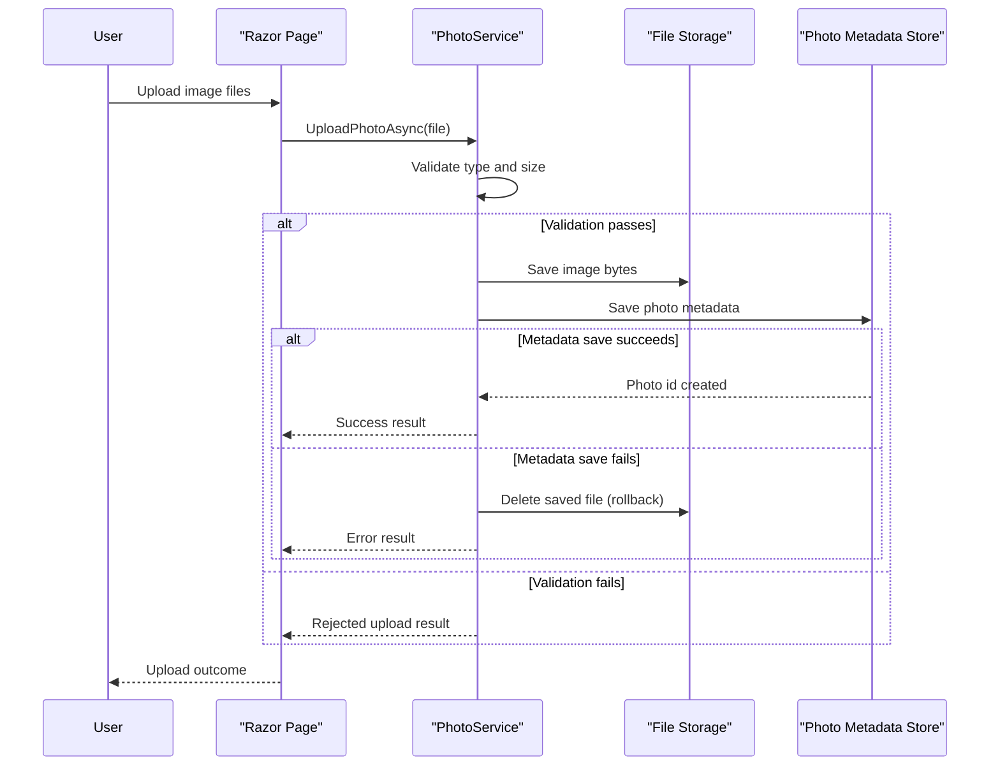

# Core Business Workflows

PhotoAlbum supports a user-facing workflow for uploading, browsing, viewing, and deleting photos, with metadata persisted for gallery management.

## Domain Entities

| Entity | Service / Bounded Context | Description | Key Relationships |
|---|---|---|---|
| Photo | Photo Management | Represents an uploaded image and display metadata | Owned by Photo service operations |
| UploadResult | Photo Management | Represents upload operation outcome | Produced by upload workflow and consumed by UI |

## Service-to-Domain Mapping

| Service | Domain Context | Owned Entities | External Dependencies |
|---|---|---|---|
| Razor Pages + PhotoService | Photo Management | Photo, UploadResult | SQL Server metadata store, local file storage |

## Primary Workflows

### Workflow 1: Upload photos to gallery

User submits one or more image files from gallery page. The app validates file type and size, writes files to storage, saves metadata to database, and returns success/failed upload details. If metadata persistence fails, file rollback is attempted.

### Workflow 2: Browse and view photo details

User opens gallery and then photo detail page. The app loads photos sorted by upload time, supports navigation to older/newer photos, and serves file bytes by photo ID.

### Workflow 3: Delete photo

User triggers delete from detail page. The app removes the physical file (best effort) and removes metadata record, then redirects to gallery.

## Cross-Service Data Flows

This is a single-service application. Cross-boundary flow occurs between business logic and two storage systems: relational metadata DB and filesystem binary storage. The upload workflow coordinates both stores and includes a rollback path to limit orphaned files.

## Business Workflow Sequence

## Business Rules & Decision Logic

- Only configured MIME types are accepted for upload.
- File size must be greater than zero and below configured max size.
- Upload path must exist before file write.
- On DB write failure after file save, the file is deleted as compensating action.
- Deletion attempts to remove file and metadata; file deletion failure is logged but metadata deletion proceeds.
