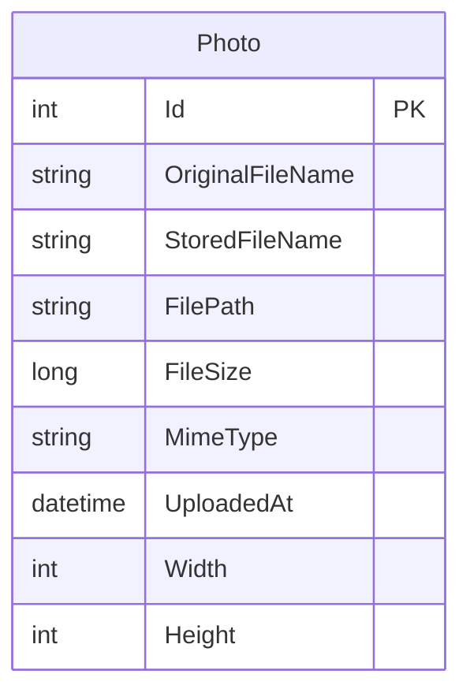

# Data Architecture & Persistence Layer

PhotoAlbum uses a compact persistence layer centered on one EF Core entity and one relational table, combined with file-system binary storage for uploaded images.

## Database Configuration

| Service/Module | DB Type | Profile | Driver | Connection | Migration Tool |
|---|---|---|---|---|---|
| PhotoAlbum | SQL Server LocalDB | Default | Microsoft.EntityFrameworkCore.SqlServer | Connection string from appsettings.json | EF Core Migrations (`Database.MigrateAsync`) |

## Data Ownership per Service

| Service | Tables Owned | ORM Framework | Caching | Notes |
|---|---|---|---|---|
| PhotoAlbum | Photos | EF Core | None | Single-module ownership; binary files stored on disk |

## Entity Model

## Key Repository Methods

| Service | Repository | Notable Methods | Purpose |
|---|---|---|---|
| PhotoAlbum | PhotoAlbumContext (`DbSet<Photo>`) | `FindAsync(id)`, `AddAsync(photo)`, `SaveChangesAsync()`, ordered query by `UploadedAt` | CRUD and retrieval of photo metadata |

## Caching Strategy

No dedicated cache provider or cache annotations are configured. Read operations query the database directly; static image responses rely on HTTP cache headers rather than application-level object/query caching.

## Data Ownership Boundaries

Data is centrally owned in a single application database with no cross-service data boundaries. The app also owns local file storage for image binaries and keeps DB metadata synchronized with file operations through rollback handling when DB save fails after file write.

### Data Classification & Sensitivity

| Entity | Sensitive Fields | Classification (PII/PHI/PCI/None) | Controls in Place |
|---|---|---|---|
| Photo | OriginalFileName (potential user-provided metadata) | Low sensitivity / Internal | No explicit encryption-at-rest or masking configuration in app code |

No PHI or PCI-specific entities were detected.
