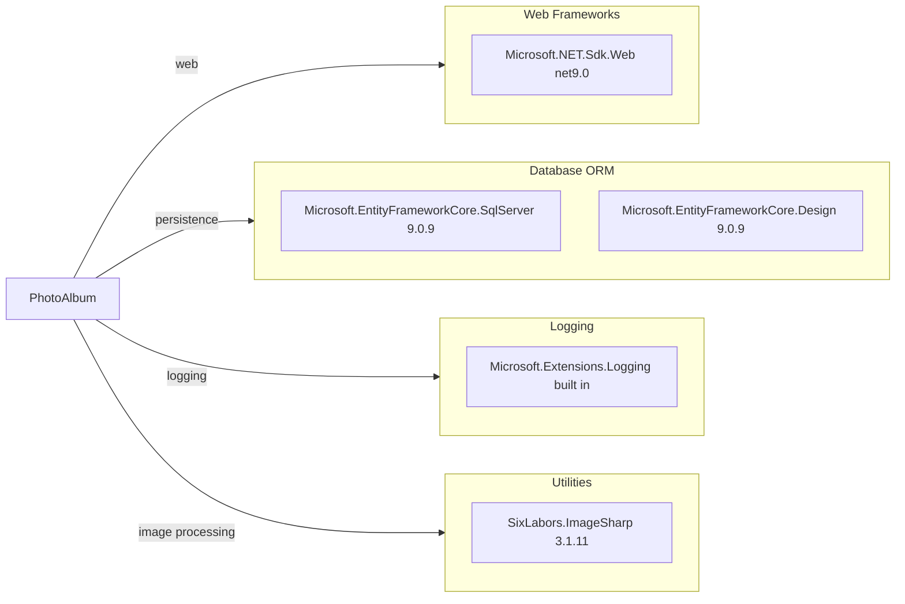

# Dependency Map

This map summarizes declared external dependencies for PhotoAlbum and groups them by functional role.

## Dependencies

### Dependency Summary

| Category | Count | Key Libraries | Notes |
|---|---:|---|---|
| Web Frameworks | 1 | Microsoft.NET.Sdk.Web | ASP.NET Core Razor Pages app |
| Database / ORM | 2 | EF Core SqlServer, EF Core Design | EF Core for relational persistence |
| Logging | 1 | Built-in ASP.NET Core logging | Framework-provided logging abstractions |
| Utilities | 1 | SixLabors.ImageSharp | Reads image metadata dimensions |

### Version & Compatibility Risks

The application targets `net9.0`, which is newer than the upcoming `net10.0` target used for upgrade assessment but may still require package compatibility checks during major-version movement. EF Core and ASP.NET package versions should be reviewed when lifting target framework.

### Notable Observations

- Storage is implemented with EF Core plus local filesystem writes instead of cloud blob SDKs.
- No explicit messaging, caching, or resilience library dependencies are declared.
- `Microsoft.EntityFrameworkCore.Design` is marked private and used for design-time operations.

## Test Dependencies

| Framework | Version | Notes |
|---|---|---|
| xunit | 2.9.2 | Unit and integration tests |
| xunit.runner.visualstudio | 2.8.2 | Test discovery/runner integration |
| Microsoft.NET.Test.Sdk | 17.12.0 | .NET test host |
| Microsoft.AspNetCore.Mvc.Testing | 9.0.9 | Web application integration test host |
| Microsoft.EntityFrameworkCore.InMemory | 9.0.9 | In-memory DB for tests |
| coverlet.collector | 6.0.2 | Code coverage collection |

Total test-scope dependencies: 6

Test infrastructure is present for service-level and integration-style testing. No contract-testing framework was detected.
