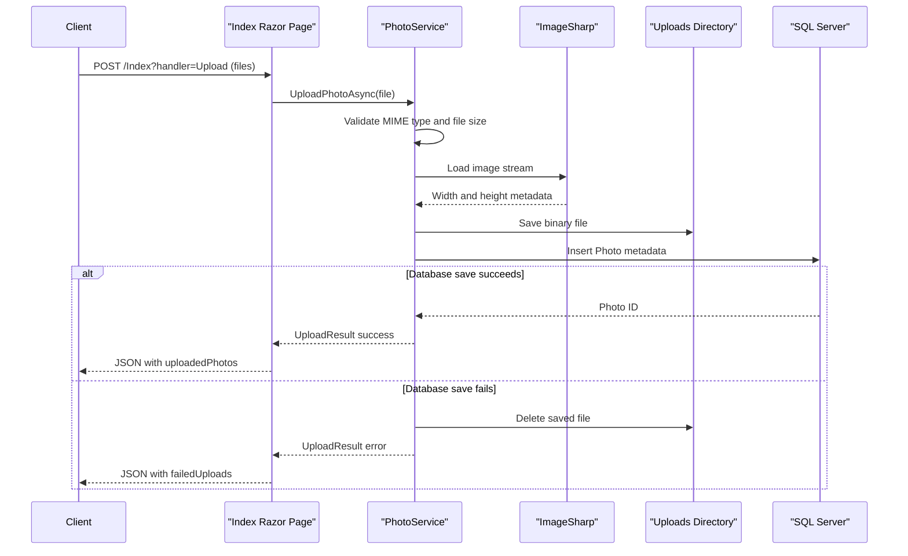

# API & Service Communication Contracts

This application exposes a small server-rendered HTTP surface made up of Razor Pages and page handlers rather than a separate REST API controller layer. All communication is synchronous and stays within a single web process.

## Service Catalog

| Service | Port | Category | Purpose |
|---|---|---|---|
| PhotoAlbum web app | 5134 HTTP, 7055 HTTPS in development; 8080 in container | API Layer | Hosts the gallery UI, upload handler, detail page, delete handler, and photo streaming endpoint |

## API Endpoints Inventory

| Service | Method | Path | Request Type | Response Type |
|---|---|---|---|---|
| PhotoAlbum web app | GET | `/` | None | HTML gallery page with photo list |
| PhotoAlbum web app | POST | `/Index?handler=Upload` | `multipart/form-data` with `List<IFormFile>` and antiforgery token | JSON result containing `uploadedPhotos` and `failedUploads`; 200 or 400 |
| PhotoAlbum web app | GET | `/Detail/{id?}` | Path parameter `id` | HTML detail page or 404 |
| PhotoAlbum web app | POST | `/Detail/{id}?handler=Delete` | Path parameter `id` plus antiforgery token | Redirect to `/` on success or back to detail page on failure |
| PhotoAlbum web app | GET | `/photo/{id}` | Path parameter `id` | Binary image file with original MIME type; 404 or 500 on failure |
| PhotoAlbum web app | GET | `/Privacy` | None | Static privacy page |

## Management & Observability Endpoints

| Service | Endpoint | Custom Metrics (if any) |
|---|---|---|
| PhotoAlbum web app | None detected (`/health`, `/swagger`, and metrics endpoints are not configured) | None |

## DTOs & Contracts

The HTTP surface uses Razor Page models (`IndexModel`, `DetailModel`, and `PhotoFileModel`) plus JSON payloads returned from the upload handler. `Photo` is the primary service-level entity surfaced back to the UI, while `UploadResult` acts as the upload operation contract inside the application service layer. Anonymous JSON response objects from `OnPostUploadAsync` carry uploaded photo metadata (`id`, `originalFileName`, `filePath`, `uploadedAt`, `fileSize`, `width`, `height`) and per-file errors; no immutable record types, OpenAPI documents, protobuf schemas, or GraphQL schemas are present. Serialization uses ASP.NET Core's default JSON stack.

## Communication Patterns

All request processing is synchronous over HTTP between the browser and the single ASP.NET Core application. Inside the process, Razor Page handlers call `IPhotoService`, which in turn uses EF Core for metadata persistence and the local file system for binary storage. There are no asynchronous messaging patterns, service discovery mechanisms, API gateways, retry or circuit-breaker libraries, or downstream HTTP client calls. Security posture is minimal: HTTPS redirection is enabled, upload and delete POSTs use antiforgery tokens, but no authentication or authorization middleware is configured, so all endpoints are effectively public.

## Service Technology Matrix

| Service | Web | Data Access | Discovery | Gateway | Actuator | Cache | Metrics |
|---|---|---|---|---|---|---|---|
| PhotoAlbum web app | Razor Pages | EF Core SQL Server | None | No | No | Static file and response cache headers only | None |

## Service Communication Sequence

