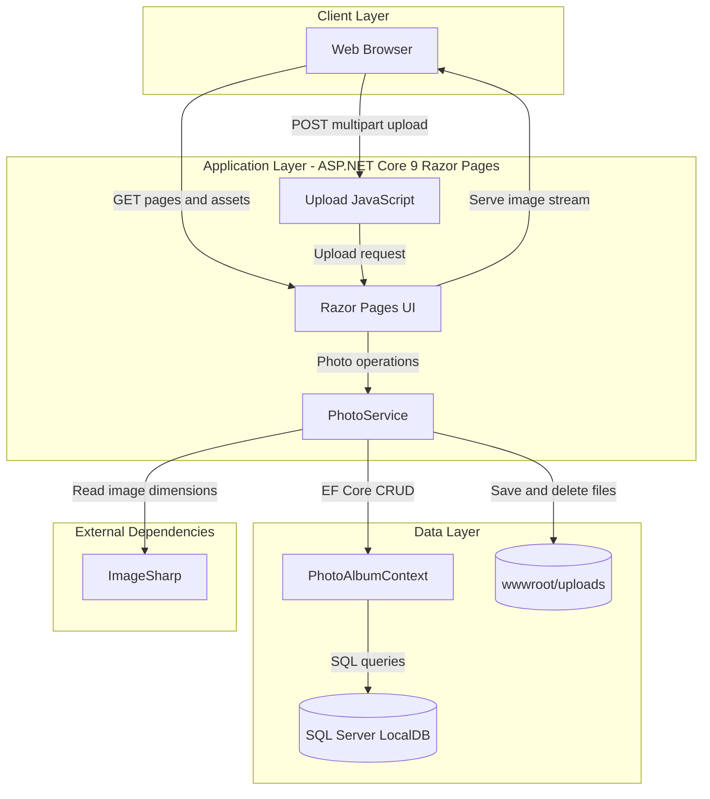
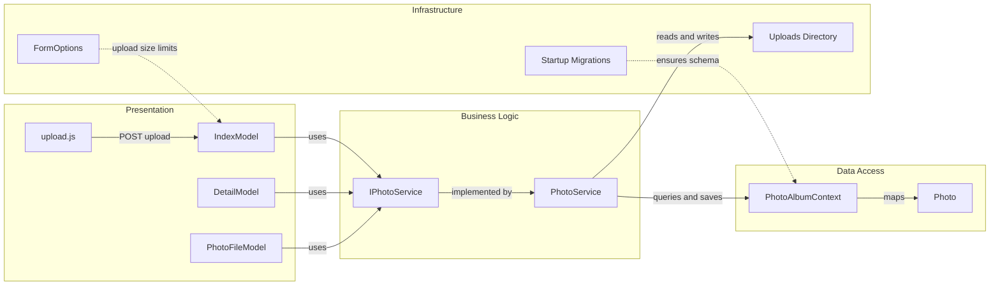

# Architecture Diagram

This document summarizes the PhotoAlbum application's runtime architecture and the main component interactions that support photo upload, retrieval, and deletion.

## Application Architecture

### Technology Stack Summary

| Layer | Technology | Version | Purpose |
|---|---|---:|---|
| Presentation | ASP.NET Core Razor Pages | 9.0 | Server-rendered UI for gallery, detail, and file endpoints |
| Client Interaction | Vanilla JavaScript + Fetch | n/a | Drag-and-drop uploads and gallery updates |
| Business Logic | PhotoService | Application code | Validates uploads and coordinates file/database persistence |
| Data Access | Entity Framework Core SQL Server | 9.0.9 | Maps the `Photo` entity and persists metadata |
| Storage | SQL Server LocalDB | Configured connection string | Stores photo metadata |
| File Storage | Local file system (`wwwroot/uploads`) | n/a | Stores uploaded image binaries |
| Image Processing | SixLabors.ImageSharp | 3.1.11 | Extracts image width and height metadata |

### Data Storage & External Services

The application uses a single SQL Server LocalDB database to store photo metadata and a local `wwwroot/uploads` directory to store the image files themselves. There are no outbound API integrations, caches, or message brokers; the only external library interaction at runtime beyond the framework is ImageSharp for image inspection.

### Key Architectural Decisions

- Uses a service-layer abstraction (`IPhotoService`/`PhotoService`) to keep Razor Page handlers thin and isolate storage logic.
- Splits binary storage from metadata persistence, with rollback logic that removes the saved file if the database write fails.
- Stores uploads on the local file system behind an indirect `/photo/{id}` endpoint instead of exposing raw file paths directly.

## Component Relationships

### Component Inventory

| Component | Layer | Type | Responsibility |
|---|---|---|---|
| `IndexModel` | Presentation | Razor Page model | Loads the gallery and handles upload POST requests |
| `DetailModel` | Presentation | Razor Page model | Shows a single photo, navigation links, and delete workflow |
| `PhotoFileModel` | Presentation | Razor Page model | Streams stored photo binaries by ID |
| `upload.js` | Presentation | Browser script | Performs client-side validation and AJAX upload requests |
| `IPhotoService` | Business Logic | Service contract | Defines photo retrieval, upload, and deletion operations |
| `PhotoService` | Business Logic | Service implementation | Validates files, extracts dimensions, stores files, and persists metadata |
| `PhotoAlbumContext` | Data Access | EF Core DbContext | Exposes the `Photos` DbSet and model configuration |
| `Photo` | Data Access | Entity | Represents persisted photo metadata |
| Form options configuration | Infrastructure | Startup configuration | Enforces multipart form upload limits |
| Startup migrations | Infrastructure | Startup routine | Applies EF Core migrations when not in the test environment |
| `wwwroot/uploads` | Infrastructure | File store | Holds uploaded image content on disk |
