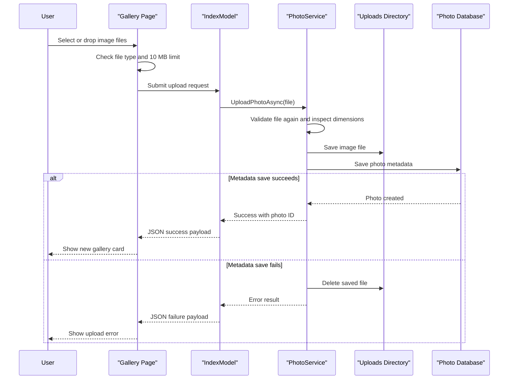

# Core Business Workflows

PhotoAlbum is a simple gallery application whose core business purpose is to let users upload, browse, inspect, and delete personal photos. The main workflows revolve around validating image uploads, persisting metadata, and serving stored images back through a controlled endpoint.

## Domain Entities

| Entity | Service / Bounded Context | Description | Key Relationships |
|---|---|---|---|
| Photo | Photo management | Represents one uploaded image together with display and storage metadata | Referenced by gallery listing, detail view, and file streaming workflow |
| UploadResult | Photo management | Captures success or failure of one upload attempt | Produced by `PhotoService` and consumed by the upload page handler |

## Service-to-Domain Mapping

| Service | Domain Context | Owned Entities | External Dependencies |
|---|---|---|---|
| PhotoAlbum web app | Photo management and gallery browsing | `Photo`, `UploadResult` | SQL Server LocalDB, local uploads directory, ImageSharp |

## Primary Workflows

### Workflow 1: Upload photos to the gallery

A browser user selects or drags image files onto the gallery page. Client-side JavaScript filters unsupported MIME types and files over 10 MB before sending a multipart POST to the upload page handler. `PhotoService` re-validates each file, extracts dimensions when possible, saves the file to disk, writes the `Photo` metadata record, and returns success or failure details for each file so the gallery can update incrementally.

### Workflow 2: Browse gallery and view a photo

The gallery page loads all `Photo` records in descending upload order and renders thumbnail cards. When a user opens a photo detail page, the page model reloads the ordered list, finds the selected photo, and computes previous/next navigation based on chronological position. The image itself is fetched separately through the `/photo/{id}` endpoint, which maps the metadata record to the stored file on disk.

### Workflow 3: Delete a photo

From the detail page, a user submits a delete request confirmed in the browser. The page handler calls `PhotoService.DeletePhotoAsync`, which attempts to remove the physical file and then deletes the metadata row from the database; if file deletion fails, the service logs the error but still removes the database record.

## Cross-Service Data Flows

No cross-service or multi-module data composition flows are present. All workflows stay inside one ASP.NET Core process, and the only coordination boundary is between SQL metadata persistence and local file-system storage. Business degradation behavior exists only in the upload path: if the database write fails after saving a file, the service compensates by deleting the file so the gallery does not accumulate orphaned content.

## Business Workflow Sequence

## Business Rules & Decision Logic

- Only JPEG, PNG, GIF, and WebP images are accepted.
- Each uploaded file must be non-empty and no larger than 10 MB.
- Gallery ordering is newest first, driven by `UploadedAt` descending.
- Upload metadata includes optional width and height when ImageSharp can read the file; failure to read dimensions does not block the upload.
- If metadata persistence fails after the file is written, the file is deleted as a compensating action.
- Delete operations tolerate file removal errors and still remove the database record to keep the gallery state consistent.
- No business-level authorization rules are implemented; any user reaching the application can upload, browse, and delete photos.
