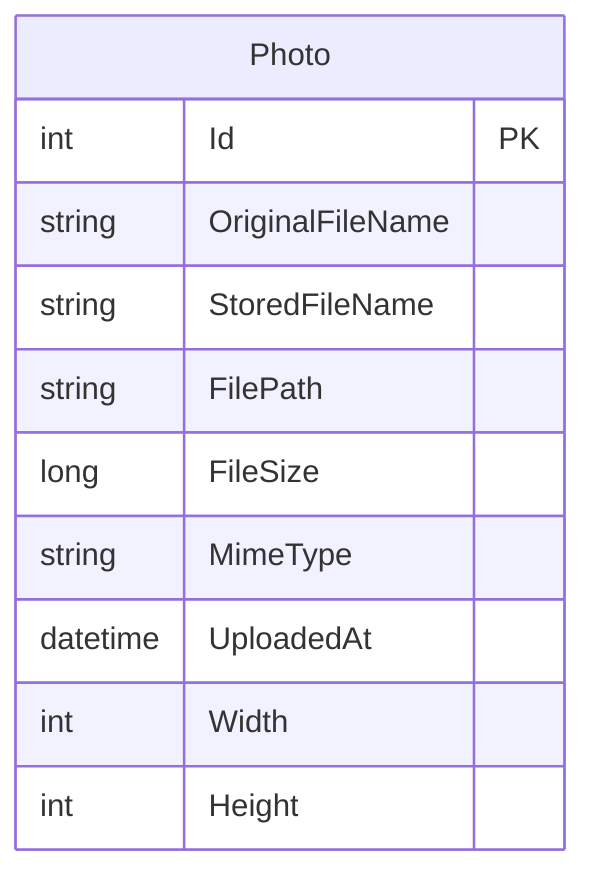

# Data Architecture & Persistence Layer

The PhotoAlbum application has a simple persistence model centered on a single `Photo` entity stored with Entity Framework Core in SQL Server while image binaries are kept on disk. There is no distributed cache or multi-service data ownership split.

## Database Configuration

| Service/Module | DB Type | Profile | Driver | Connection | Migration Tool |
|---|---|---|---|---|---|
| PhotoAlbum | SQL Server LocalDB | Default / local runtime | EF Core SQL Server provider 9.0.9 | `Server=(localdb)\\mssqllocaldb;Database=PhotoAlbumDb;Trusted_Connection=true;MultipleActiveResultSets=true` | EF Core Migrations |
| PhotoAlbum.Tests | In-memory EF Core store | Test host | EF Core InMemory 9.0.9 | In-process test database | None |

No seed scripts or separate schema management tools were detected. The application applies EF Core migrations at startup unless `IsTestEnvironment` is set.

## Data Ownership per Service

| Service | Tables Owned | ORM Framework | Caching | Notes |
|---|---|---|---|---|
| PhotoAlbum | `Photos` | EF Core | None | Single database table plus local file-system binary storage |

## Entity Model

## Key Repository Methods

| Service | Repository | Notable Methods | Purpose |
|---|---|---|---|
| PhotoAlbum | `PhotoAlbumContext` (`PhotoAlbum/Data/PhotoAlbumContext.cs`) | `DbSet<Photo> Photos`, startup `MigrateAsync()` usage | Central EF Core access point for querying and saving `Photo` rows |
| PhotoAlbum | `PhotoService` (`PhotoAlbum/Services/PhotoService.cs`) | `GetAllPhotosAsync()`, `GetPhotoByIdAsync(int)`, `UploadPhotoAsync(IFormFile)`, `DeletePhotoAsync(int)` | Implements all photo retrieval and mutation behavior on top of EF Core and file storage |

The solution does not define separate repository interface classes; the service layer talks directly to the DbContext.

## Caching Strategy

The application does not configure a dedicated caching provider such as MemoryCache, Redis, or a second-level ORM cache. Caching is limited to HTTP response headers: static assets receive a one-hour cache header and streamed photo responses receive a one-year cache header with an ETag derived from photo ID and upload timestamp.

## Data Ownership Boundaries

All persisted application data is owned by the single PhotoAlbum web application. Metadata lives in one SQL Server database table and binary files are co-owned by the same application in the local uploads directory, so there are no cross-service joins, CQRS projections, or external data access patterns. Read and write flows remain strongly consistent within one process except for the intentional two-step file-plus-database write path, where the service deletes the saved file if the database insert fails.

### Data Classification & Sensitivity

| Entity | Sensitive Fields | Classification (PII/PHI/PCI/None) | Controls in Place |
|---|---|---|---|
| Photo | `OriginalFileName` may contain user-supplied personal naming information; image content may contain user photos outside the database model | PII | No field-level masking or explicit encryption controls are configured in application code |

The entity model does not store PHI or PCI data.
