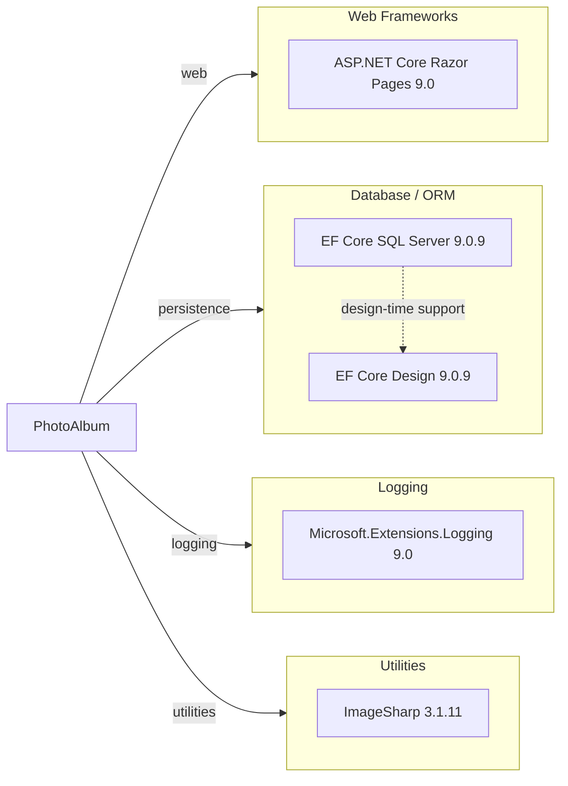

# Dependency Map

This document summarizes the PhotoAlbum solution's declared dependencies. The solution has 3 production package references, 1 implicit web framework dependency, and 6 test-scoped package references.

## Dependencies

### Dependency Summary

| Category | Count | Key Libraries | Notes |
|---|---:|---|---|
| Web Frameworks | 1 | ASP.NET Core Razor Pages 9.0 | Provided implicitly by `Microsoft.NET.Sdk.Web` |
| Database / ORM | 2 | EF Core SQL Server 9.0.9, EF Core Design 9.0.9 | SQL Server provider plus migration/design-time tooling |
| Logging | 1 | Microsoft.Extensions.Logging 9.0 | Framework-provided logging used by page models and services |
| Utilities | 1 | SixLabors.ImageSharp 3.1.11 | Used to inspect image dimensions during upload |

### Version & Compatibility Risks

The application already targets .NET 9.0, so the main compatibility consideration is forward migration to .NET 10 and matching package support in EF Core and ASP.NET Core. SQL Server LocalDB is a developer-friendly dependency, but it is Windows-centric and may require replacement or reconfiguration for Linux-hosted modernization targets.

### Notable Observations

- Production dependencies are intentionally small; most behavior comes from the ASP.NET Core web SDK and EF Core provider packages.
- `Microsoft.EntityFrameworkCore.Design` is a design-time dependency only and is correctly marked with `PrivateAssets=all`.
- Image storage is implemented in application code rather than via a storage SDK, which explains the lack of Azure or blob-related packages.
- No dedicated authentication, observability, caching, or messaging packages are declared in the project files.

## Test Dependencies

| Framework | Version | Notes |
|---|---:|---|
| xUnit | 2.9.2 | Primary unit and integration test framework |
| xUnit runner Visual Studio | 2.8.2 | IDE and test host runner integration |
| Microsoft.NET.Test.Sdk | 17.12.0 | Test execution infrastructure |
| Microsoft.AspNetCore.Mvc.Testing | 9.0.9 | Hosts the web app in integration-style tests |
| Microsoft.EntityFrameworkCore.InMemory | 9.0.9 | Replaces SQL Server with in-memory persistence during tests |
| coverlet.collector | 6.0.2 | Code coverage collector |

Total test-scope dependencies: 6

The test stack is current for the application's .NET 9 target and provides both web-host integration support and an in-memory EF Core provider. No separate contract-testing or browser automation dependency is present.
