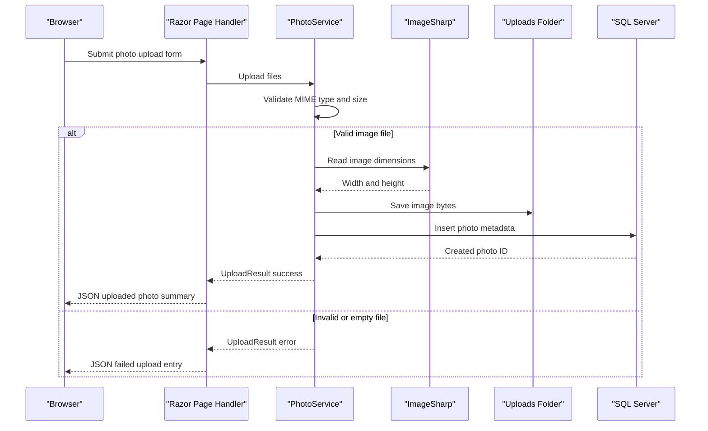

# API & Service Communication Contracts

The application exposes a small Razor Pages HTTP surface with page handlers for gallery browsing, upload, detail viewing, deletion, and indirect photo file retrieval. Communication is synchronous in-process from page models to `IPhotoService`; no inter-service APIs or asynchronous brokers were detected.

## Service Catalog

| Service | Port | Category | Purpose |
|---|---:|---|---|
| PhotoAlbum | 5134 HTTP / 7055 HTTPS in launch profile; 8080 in container | API Layer | Serves Razor Pages UI and photo file responses for the photo gallery |
| SQL Server LocalDB | Local process | Infrastructure | Stores photo metadata for development/runtime configuration |

## API Endpoints Inventory

| Service | Method | Path | Request Type | Response Type |
|---|---|---|---|---|
| PhotoAlbum | GET | `/` or `/Index` | None | Razor Page with `List<Photo>` gallery model |
| PhotoAlbum | POST | `/Index?handler=Upload` | Multipart form files named `files` | JSON object with upload success, uploaded photo summaries, and failed upload entries |
| PhotoAlbum | GET | `/Detail?id=<photoId>` | Query parameter `id` | Razor Page with selected `Photo` plus previous and next IDs; 404 if absent |
| PhotoAlbum | POST | `/Detail?handler=Delete&id=<photoId>` | Query or form parameter `id` | Redirect to index on success; redirect with temp-data error on failure |
| PhotoAlbum | GET | `/PhotoFile?id=<photoId>` | Query parameter `id` | File bytes with stored MIME type, 404 if metadata or file is absent, 500 on unexpected read error |

## Management & Observability Endpoints

| Service | Endpoint | Custom Metrics (if any) |
|---|---|---|
| PhotoAlbum | None detected | None detected |

## DTOs & Contracts

`Photo` is the service-level domain entity used as a page response model for gallery and detail views. `UploadResult` is an internal service result contract used by the upload handler to translate service outcomes into JSON response entries. Anonymous JSON response shapes are produced by the upload handler for uploaded photo summaries and failed upload errors. No OpenAPI, Swagger, GraphQL, or protobuf contract files were detected; serialization uses ASP.NET Core defaults based on System.Text.Json for `JsonResult`.

## Communication Patterns

All communication is synchronous. Browser requests enter Razor Page handlers, which call `IPhotoService` directly in-process. `PhotoService` uses EF Core for SQL Server metadata access and local filesystem calls for binary storage; there are no REST clients, gRPC clients, service discovery mechanisms, message queues, retries, circuit breakers, or API gateway aggregation flows. HTTPS redirection is enabled in the middleware pipeline, but no authentication or authorization policy is configured beyond the default `UseAuthorization` middleware, so application endpoints are effectively publicly accessible unless hosting infrastructure adds controls.

## Service Technology Matrix

| Service | Web | Data Access | Discovery | Gateway | Actuator | Cache | Metrics |
|---|---|---|---|---|---|---|---|
| PhotoAlbum | Razor Pages | EF Core SQL Server | None | None | None | Static file cache headers only | Built-in logging only |

## Service Communication Sequence

