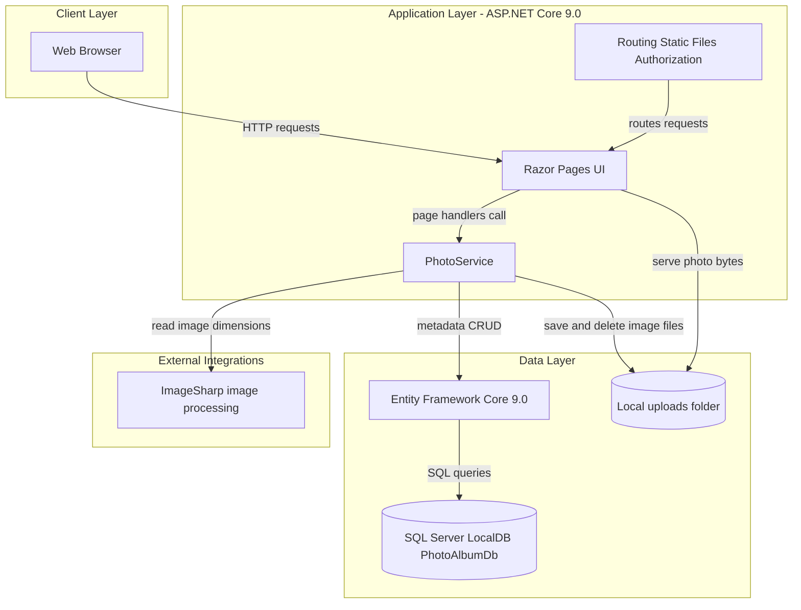
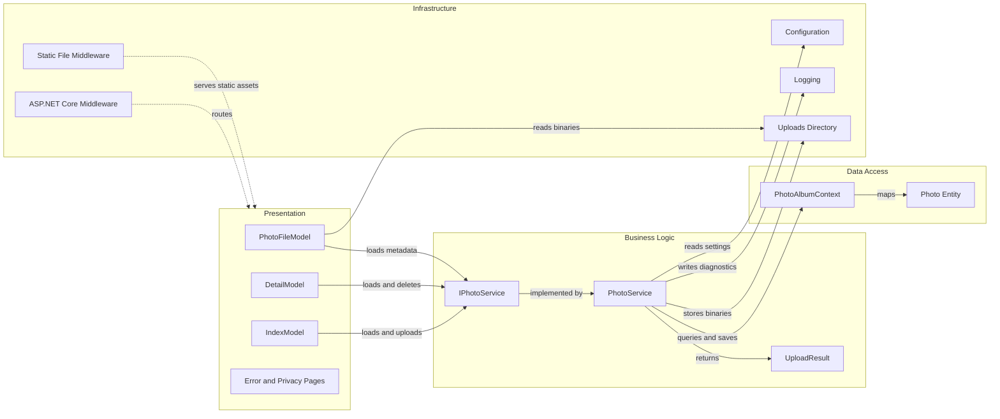

# Architecture Diagram

PhotoAlbum is a single ASP.NET Core Razor Pages application that serves a browser-based photo gallery, persists photo metadata with Entity Framework Core, and stores image binaries on local disk.

## Application Architecture

### Technology Stack Summary

| Layer | Technology | Version | Purpose |
|---|---:|---:|---|
| Presentation | ASP.NET Core Razor Pages | 9.0 | Server-rendered gallery, detail, upload, and file-serving pages |
| Application Services | ASP.NET Core dependency injection | 9.0 | Registers `IPhotoService` for photo operations |
| Data Access | Entity Framework Core SQL Server | 9.0.9 | Persists photo metadata and applies migrations |
| Binary Storage | Local filesystem | N/A | Stores uploaded images under `wwwroot/uploads` |
| Image Processing | SixLabors.ImageSharp | 3.1.11 | Reads image dimensions during upload |
| Testing | xUnit and ASP.NET Core MVC Testing | 2.9.2 / 9.0.9 | Unit and integration test support |

### Data Storage & External Services

The application stores structured photo metadata in SQL Server LocalDB via EF Core and stores uploaded image binaries on the application filesystem. There are no external API, messaging, cache, or identity-provider integrations in the current implementation.

### Key Architectural Decisions

- The service layer is abstracted behind `IPhotoService`, which isolates Razor Pages from the storage implementation.
- EF Core migrations are applied during startup unless `IsTestEnvironment` is set, making schema creation part of application bootstrapping.
- Binary files and database metadata are kept consistent by deleting the saved file if metadata persistence fails.

## Component Relationships

### Component Inventory

| Component | Layer | Type | Responsibility |
|---|---|---|---|
| `IndexModel` | Presentation | Razor PageModel | Displays the gallery and handles multi-file upload requests |
| `DetailModel` | Presentation | Razor PageModel | Displays one photo, calculates previous and next navigation, and handles deletion |
| `PhotoFileModel` | Presentation | Razor PageModel | Serves image bytes indirectly by photo ID |
| `IPhotoService` | Business Logic | Service interface | Defines photo retrieval, upload, and deletion operations |
| `PhotoService` | Business Logic | Service implementation | Validates uploads, extracts dimensions, manages filesystem storage, and persists metadata |
| `UploadResult` | Business Logic | Transfer object | Carries upload success, created photo ID, filename, and error message |
| `PhotoAlbumContext` | Data Access | EF Core DbContext | Owns the `Photos` set and entity mapping |
| `Photo` | Data Access | EF Core entity | Represents persisted photo metadata |
| ASP.NET Core middleware | Infrastructure | Middleware pipeline | Configures HTTPS redirection, static files, routing, authorization, and Razor Pages |
