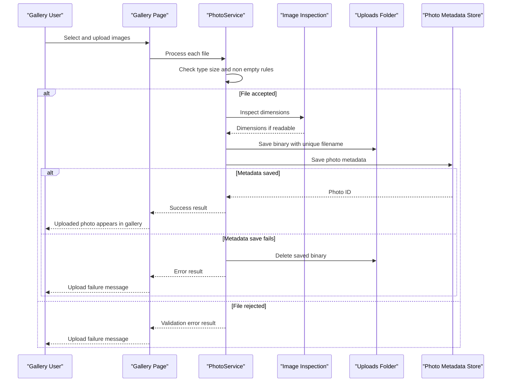

# Core Business Workflows

PhotoAlbum lets users manage a simple photo gallery by uploading image files, browsing uploaded photos, viewing details, serving image content, and deleting photos.

## Domain Entities

| Entity | Service / Bounded Context | Description | Key Relationships |
|---|---|---|---|
| Photo | PhotoAlbum / Gallery Management | Represents an uploaded image and the metadata needed to display, retrieve, and delete it | Standalone aggregate; linked to a binary file in the uploads folder |
| UploadResult | PhotoAlbum / Upload Workflow | Represents the business outcome of one upload attempt | References the created photo ID on success or an error message on failure |

## Service-to-Domain Mapping

| Service | Domain Context | Owned Entities | External Dependencies |
|---|---|---|---|
| PhotoAlbum | Gallery Management | Photo, UploadResult | SQL Server metadata store, local uploads directory, ImageSharp image inspection |

## Primary Workflows

### Workflow 1: Upload Photos

A user submits one or more image files from the gallery page. The page handler rejects empty submissions, then processes each file through `PhotoService`. Each file is checked against allowed MIME types, maximum size, and non-empty content rules. For valid files, the service generates a GUID-based stored filename, reads dimensions when possible, saves the image bytes, persists metadata, and returns a success result. If metadata persistence fails after file save, the service deletes the saved file as compensation.

### Workflow 2: Browse and View Photos

A user opens the gallery page, and the application retrieves all photos ordered by upload time from newest to oldest. When the user opens a detail page, the application loads the same ordered set, selects the requested photo, and computes previous and next photo IDs for navigation. Missing or invalid IDs result in a not-found response.

### Workflow 3: Serve Photo Content

A user or browser requests a photo file by photo ID. The application loads photo metadata, derives the stored filename safely from the persisted path, reads bytes from the uploads directory, sets cache headers and an ETag, and returns the file with its MIME type. Missing metadata or missing files produce a not-found response.

### Workflow 4: Delete Photo

A user requests deletion from the detail page. The service looks up the photo, attempts to delete the stored binary file, then removes metadata from the database. If file deletion fails, metadata deletion still proceeds and the failure is logged.

## Cross-Service Data Flows

No cross-service workflows were detected. All workflows execute inside the PhotoAlbum process and coordinate between Razor Page handlers, `PhotoService`, EF Core, ImageSharp, and the local filesystem. There are no gateway aggregation flows, downstream service fallbacks, or business degradation paths caused by circuit breakers.

## Business Workflow Sequence

## Business Rules & Decision Logic

- Uploads must include at least one file; otherwise the request is rejected.
- Accepted files must have an allowed image MIME type, must not exceed the configured maximum size, and must not be empty.
- Stored filenames are generated with GUID values to avoid collisions while preserving the original filename in metadata.
- Image dimensions are useful metadata but are not mandatory; upload continues if dimension extraction fails.
- Metadata persistence failure after binary save triggers compensating deletion of the saved file.
- Gallery ordering is newest-first based on upload timestamp.
- Detail navigation uses the gallery order to identify newer and older neighboring photos.
- Delete operations prioritize removing metadata even if binary deletion fails, while logging the file deletion error.
- No business-level authorization, approval state, or multi-tenant ownership rules were detected.
