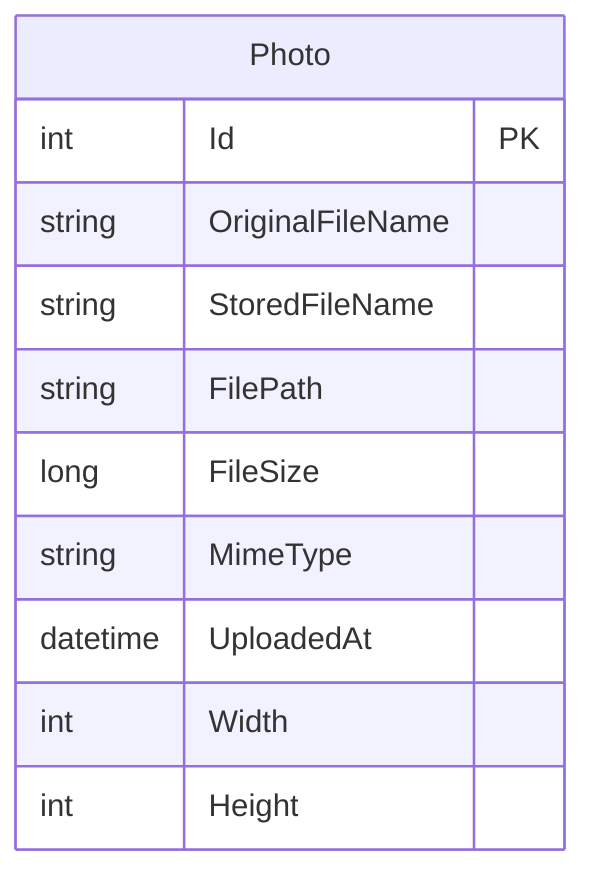

# Data Architecture & Persistence Layer

The data layer contains one EF Core entity backed by SQL Server metadata storage and local filesystem binary storage for uploaded images.

## Database Configuration

| Service/Module | DB Type | Profile | Driver | Connection | Migration Tool |
|---|---|---|---|---|---|
| PhotoAlbum | SQL Server LocalDB | Default | Microsoft.Data.SqlClient via EF Core SQL Server | LocalDB database named PhotoAlbumDb with trusted connection | EF Core migrations |
| PhotoAlbum.Tests | In-memory database | Test | EF Core InMemory provider | Test host configuration | Test setup; startup migrations skipped when `IsTestEnvironment` is true |

## Data Ownership per Service

| Service | Tables Owned | ORM Framework | Caching | Notes |
|---|---|---|---|---|
| PhotoAlbum | Photos | Entity Framework Core | No data cache detected | Owns photo metadata; image bytes are stored separately in the configured uploads directory |

## Entity Model

The `Photo` entity is configured by `PhotoAlbumContext` with required metadata fields and a descending index on `UploadedAt` for newest-first gallery queries. No relationships to other entities are present.

## Key Repository Methods

| Service | Repository | Notable Methods | Purpose |
|---|---|---|---|
| PhotoAlbum | `PhotoAlbumContext.Photos` DbSet | `OrderByDescending(p => p.UploadedAt).ToListAsync()` | Loads gallery photos in reverse chronological order |
| PhotoAlbum | `PhotoAlbumContext.Photos` DbSet | `FindAsync(id)` | Retrieves photo metadata by primary key for detail, file serving, and deletion |
| PhotoAlbum | `PhotoAlbumContext.Photos` DbSet | `AddAsync(photo)` plus `SaveChangesAsync()` | Persists uploaded photo metadata after file storage succeeds |
| PhotoAlbum | `PhotoAlbumContext.Photos` DbSet | `Remove(photo)` plus `SaveChangesAsync()` | Deletes photo metadata after attempting binary file deletion |

## Caching Strategy

No application data cache provider, distributed cache, EF second-level cache, or query result cache was detected. The app configures HTTP cache headers for static files for one hour and for served photo files for one year with an ETag based on photo ID and upload timestamp.

## Data Ownership Boundaries

PhotoAlbum is a single-service application with a shared local SQL Server metadata store and local filesystem binary store. There are no cross-service data access patterns, CQRS separation, or gateway aggregation enablers. The main ownership boundary to address during modernization is that photo metadata and image bytes are stored in different resource types and must remain consistent across upload and delete workflows.

### Data Classification & Sensitivity

| Entity | Sensitive Fields | Classification (PII/PHI/PCI/None) | Controls in Place |
|---|---|---|---|
| Photo | OriginalFileName may contain user-provided identifying text; image content is stored as uploaded | Potential PII | No field-level encryption, masking, or access controls detected in the application |
