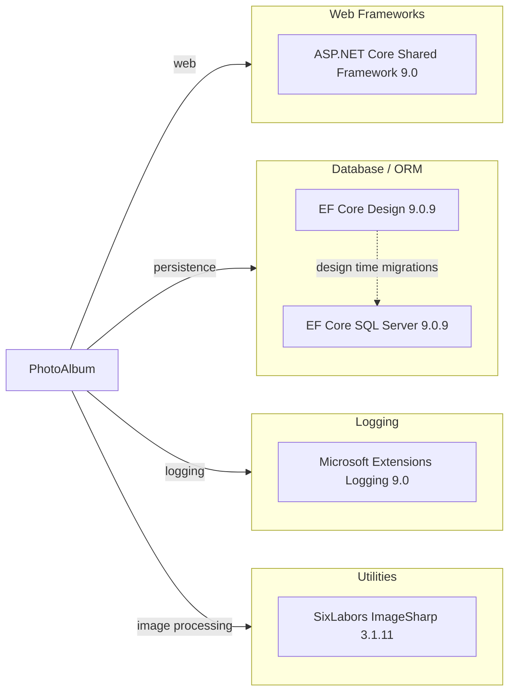

# Dependency Map

PhotoAlbum declares 9 external NuGet package dependencies across the application and test projects; 3 production packages are used by the web application and 6 are test scoped.

## Dependencies

### Dependency Summary

| Category | Count | Key Libraries | Notes |
|---|---:|---|---|
| Web Frameworks | 1 | ASP.NET Core shared framework 9.0 | Provided by `Microsoft.NET.Sdk.Web` and the .NET runtime |
| Database / ORM | 2 | Microsoft.EntityFrameworkCore.SqlServer 9.0.9, Microsoft.EntityFrameworkCore.Design 9.0.9 | SQL Server provider and design-time migration tooling |
| Logging | 1 | Microsoft.Extensions.Logging 9.0 | Provided through ASP.NET Core abstractions |
| Utilities | 1 | SixLabors.ImageSharp 3.1.11 | Used to inspect uploaded image dimensions |

### Version & Compatibility Risks

The application targets `net9.0`, while the requested modernization target is `net10.0`. EF Core packages are pinned to 9.0.9 and should be evaluated for corresponding 10.x availability during an upgrade. Local filesystem image storage can become a migration risk for scaled or cloud-hosted deployments because application instances do not share disk state.

### Notable Observations

- Production dependencies are minimal and centered on ASP.NET Core, EF Core SQL Server, and ImageSharp.
- `Microsoft.EntityFrameworkCore.Design` is marked with private assets and does not flow transitively to consumers.
- No messaging, distributed cache, identity, observability exporter, or resilience libraries are declared.
- The test project adds in-memory EF Core and ASP.NET Core test host packages for isolated test execution.

## Test Dependencies

| Framework | Version | Notes |
|---|---:|---|
| xUnit | 2.9.2 | Primary test framework |
| xUnit runner visualstudio | 2.8.2 | Visual Studio and `dotnet test` integration |
| Microsoft.NET.Test.Sdk | 17.12.0 | Test platform SDK |
| Microsoft.AspNetCore.Mvc.Testing | 9.0.9 | Integration test host support |
| Microsoft.EntityFrameworkCore.InMemory | 9.0.9 | In-memory data provider for tests |
| coverlet.collector | 6.0.2 | Coverage collection support |

Total test-scope dependencies: 6
The test infrastructure supports service and web-host based tests with an in-memory database; no contract-testing or browser automation libraries were detected.
