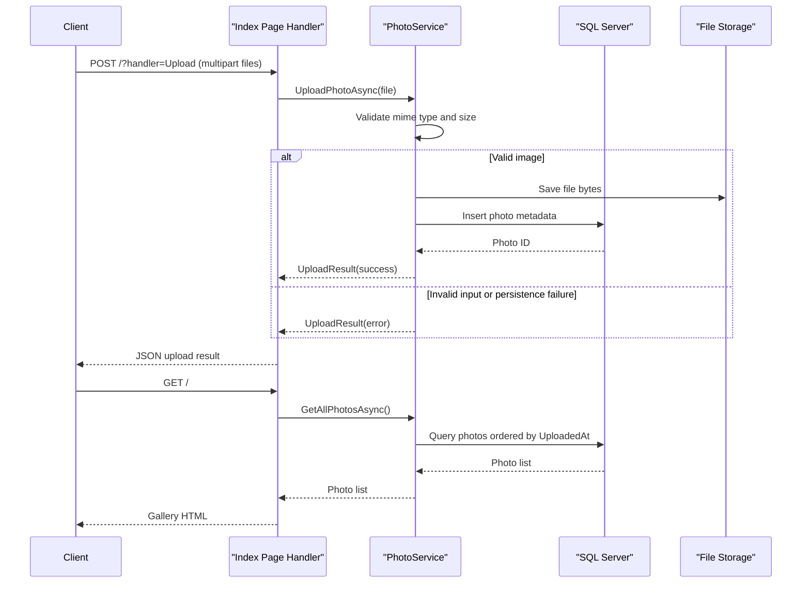

# API & Service Communication Contracts

PhotoAlbum exposes a page-handler-driven HTTP surface through Razor Pages, with synchronous in-process communication between PageModels and the photo service. The contract is compact and centered on gallery listing, upload, detail retrieval, deletion, and file streaming.

## Service Catalog

| Service | Port | Category | Purpose |
|---|---|---|---|
| PhotoAlbum (single web app) | 5134 (HTTP), 7055 (HTTPS dev profile) | API Layer + Business | Serves gallery UI, accepts uploads, and provides photo retrieval/deletion handlers |

## API Endpoints Inventory

| Service | Method | Path | Request Type | Response Type |
|---|---|---|---|---|
| PhotoAlbum | GET | `/` (`/Index`) | None | HTML page with gallery model |
| PhotoAlbum | POST | `/?handler=Upload` | multipart form (`List<IFormFile> files`) | JSON `{ success, uploadedPhotos, failedUploads }` |
| PhotoAlbum | GET | `/Detail/{id?}` | Path parameter `id` | HTML detail page or 404 |
| PhotoAlbum | POST | `/Detail/{id?}?handler=Delete` | Path parameter `id` + antiforgery token | Redirect to `/Index` (or back to detail on failure) |
| PhotoAlbum | GET | `/PhotoFile?id={id}` | Query parameter `id` | Binary file (`photo.MimeType`) or 404/500 |

## Management & Observability Endpoints

| Service | Endpoint | Custom Metrics (if any) |
|---|---|---|
| PhotoAlbum | None explicitly configured (`/health`, `/swagger`, `/metrics` not found) | None detected |

## DTOs & Contracts

Request/response contracts are primarily Razor PageModel-bound types and JSON anonymous objects. `Photo` acts as the service-level domain entity and is returned to views, while upload responses use lightweight JSON payloads containing identifiers and metadata fields. No OpenAPI spec, protobuf schema, or GraphQL schema is present; serialization uses ASP.NET Core defaults (`System.Text.Json`) for JSON results.

## Communication Patterns

All communication is synchronous. Browser requests are handled by Razor Page handlers, which call `IPhotoService` via dependency injection, and `PhotoService` then performs EF Core database calls and filesystem access. No asynchronous broker/event pipeline, service discovery, API gateway, retry library, or circuit breaker framework is configured. Startup ordering is simple (single process), with availability gated by application startup and migration execution. Authentication/authorization and TLS enforcement at API-contract level are minimal: development profiles expose both HTTP/HTTPS; no explicit authentication scheme or role-based endpoint guard is configured.

## Service Technology Matrix

| Service | Web | Data Access | Discovery | Gateway | Actuator | Cache | Metrics |
|---|---|---|---|---|---|---|---|
| PhotoAlbum | Razor Pages | EF Core SqlServer | None | None | None | None | None |

## Service Communication Sequence

