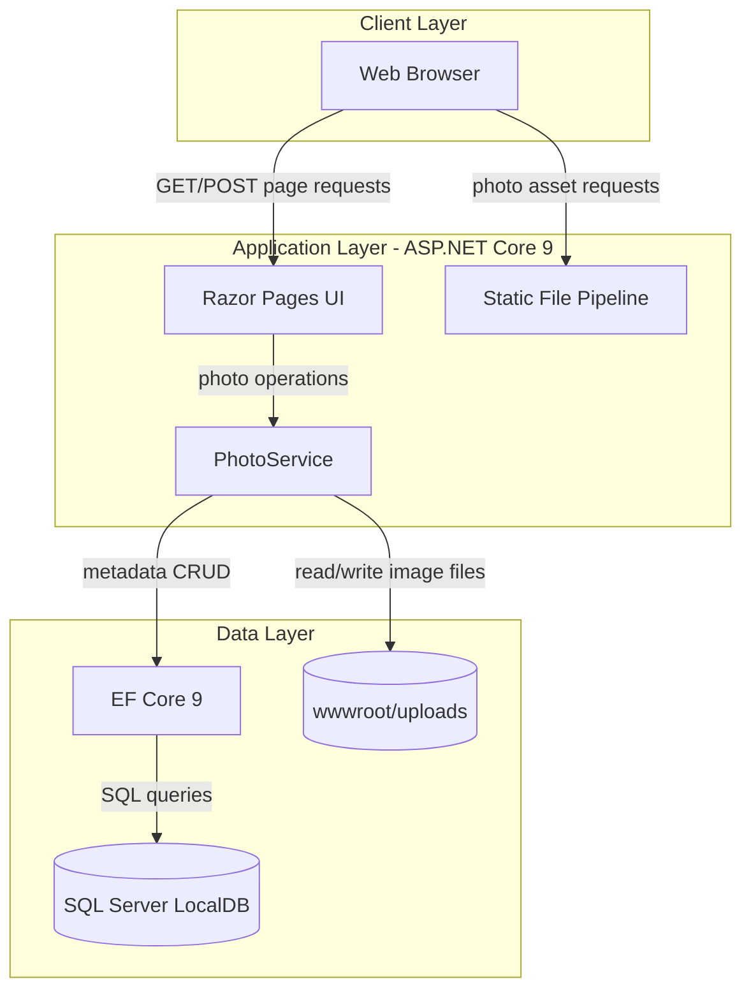
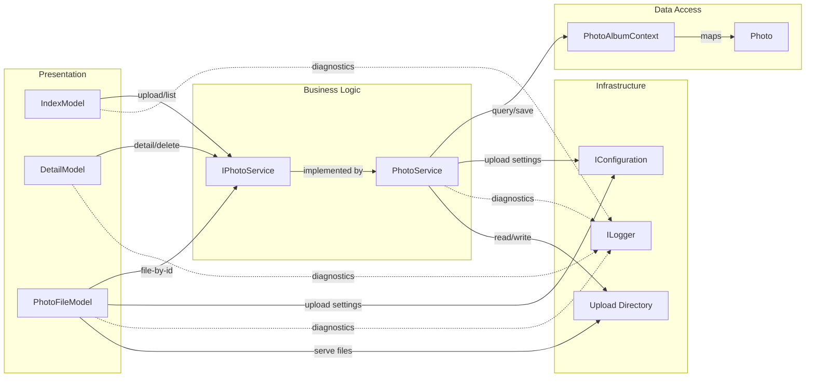

# Architecture Diagram

PhotoAlbum is a single-service ASP.NET Core Razor Pages application that stores photo metadata in SQL Server and image binaries on local disk. The diagrams below summarize runtime layers and core component interactions.

## Application Architecture

### Technology Stack Summary

| Layer | Technology | Version | Purpose |
|---|---|---|---|
| Presentation | ASP.NET Core Razor Pages | 9.0 | UI rendering, form handlers, and page routing |
| Business Logic | PhotoService | In-repo | Upload validation, file processing, and metadata lifecycle |
| Data Access | Entity Framework Core SqlServer | 9.0.9 | ORM and SQL persistence |
| Image Processing | SixLabors.ImageSharp | 3.1.11 | Image dimension extraction |
| Storage | SQL Server LocalDB + local filesystem | LocalDB + disk | Metadata in DB and image bytes in `wwwroot/uploads` |

### Data Storage & External Services

The application uses SQL Server LocalDB for photo metadata (name, mime type, size, dimensions, timestamps) and stores image files on local disk under `wwwroot/uploads`. No external API, message broker, or remote cache integration is configured.

### Key Architectural Decisions

- Razor Pages handlers call a dedicated `IPhotoService` abstraction instead of directly using `DbContext`.
- File-system and database writes are coordinated with rollback behavior when DB persistence fails.
- Startup applies EF Core migrations automatically unless `IsTestEnvironment` is enabled.

## Component Relationships

### Component Inventory

| Component | Layer | Type | Responsibility |
|---|---|---|---|
| IndexModel | Presentation | Razor PageModel | Gallery view and multi-file upload handler |
| DetailModel | Presentation | Razor PageModel | Photo detail display and delete action |
| PhotoFileModel | Presentation | Razor PageModel endpoint | Streams stored photo bytes by ID |
| IPhotoService | Business Logic | Service contract | Abstracts photo operations |
| PhotoService | Business Logic | Service implementation | Validation, disk IO, image metadata extraction, persistence |
| PhotoAlbumContext | Data Access | EF Core DbContext | Configures `Photos` table and index |
| Photo | Data Access | Entity model | Photo metadata persisted in SQL Server |
