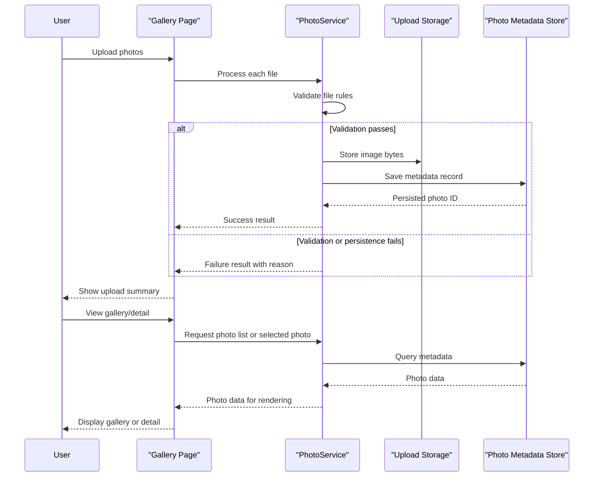

# Core Business Workflows

The application’s business domain is lightweight photo gallery management: users upload images, browse them chronologically, view metadata, and remove entries. The core workflows center around file validation, metadata persistence, and gallery navigation.

## Domain Entities

| Entity | Service / Bounded Context | Description | Key Relationships |
|---|---|---|---|
| Photo | Photo Management | Represents one uploaded image and its metadata lifecycle | Referenced by gallery listing, detail display, file streaming, and deletion workflows |
| UploadResult | Photo Management | Business outcome object for single-file upload attempt | Connects validation/persistence outcomes to UI JSON response |

## Service-to-Domain Mapping

| Service | Domain Context | Owned Entities | External Dependencies |
|---|---|---|---|
| PhotoAlbum web app | Photo Management | Photo, UploadResult | SQL Server (metadata), filesystem storage (image bytes) |

## Primary Workflows

### Workflow 1: Upload Photos to Gallery

Entry point: `POST /?handler=Upload` from the gallery page.

1. User submits one or more files.
2. Each file is validated for content type, file size, and non-empty payload.
3. Service extracts dimensions when possible and writes bytes to upload storage.
4. Service persists metadata to the database.
5. If DB save fails, the uploaded file is deleted as compensation.
6. UI receives per-file success/failure details and updates gallery feedback.

### Workflow 2: Browse and Inspect Photo Details

Entry points: `GET /` and `GET /Detail/{id}`.

1. Gallery query returns photos sorted by upload time.
2. User opens a detail page for a selected photo.
3. Detail workflow computes previous/next navigation based on chronological ordering.
4. Browser loads image content through `/PhotoFile?id={id}` and renders metadata.

### Workflow 3: Delete a Photo

Entry point: `POST /Detail/{id}?handler=Delete`.

1. User confirms deletion action.
2. Service locates metadata, attempts file deletion, then removes DB row.
3. User is redirected back to gallery.
4. If failure occurs, an error message is shown on the detail page.

## Cross-Service Data Flows

No multi-service topology exists; all business operations execute in-process in the same web application. Data flow still spans two stores: metadata operations use SQL while image content is read/written on disk, and both are coordinated in `PhotoService` to keep user-visible consistency.

## Business Workflow Sequence

## Business Rules & Decision Logic

- Allowed uploads are limited to configured image MIME types (JPEG, PNG, GIF, WebP).
- Maximum file size is enforced from configuration (default 10 MB).
- Empty files are rejected.
- Metadata save failure triggers compensating deletion of the just-written file.
- Deletion workflow attempts filesystem cleanup and metadata removal; metadata operation remains authoritative for gallery state.
- Navigation logic on detail page derives previous/next photo from chronological ordering.
