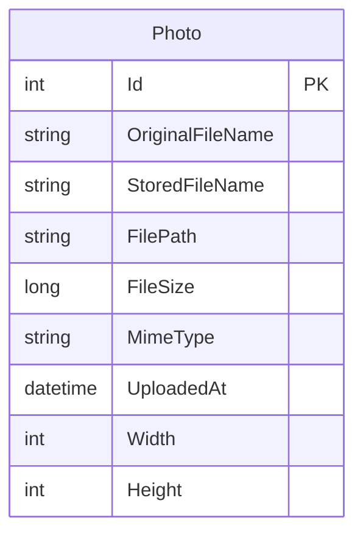

# Data Architecture & Persistence Layer

PhotoAlbum uses a single relational persistence model with EF Core and one primary entity for photo metadata, while storing file binaries on disk. The data layer is simple and centralized, with one DbContext and one table-focused repository pattern through service abstraction.

## Database Configuration

| Service/Module | DB Type | Profile | Driver | Connection | Migration Tool |
|---|---|---|---|---|---|
| PhotoAlbum | SQL Server LocalDB | Default/Development | EF Core SqlServer provider | LocalDB connection string from appsettings | EF Core Migrations (`Database.MigrateAsync`) |
| PhotoAlbum.Tests | In-memory database | Test runtime | EF Core InMemory provider | Configured by test host | None (ephemeral test store) |

## Data Ownership per Service

| Service | Tables Owned | ORM Framework | Caching | Notes |
|---|---|---|---|---|
| PhotoAlbum | `Photos` | EF Core | None | Single-service ownership with metadata/file split (DB + filesystem) |

## Entity Model

## Key Repository Methods

| Service | Repository | Notable Methods | Purpose |
|---|---|---|---|
| PhotoAlbum | `PhotoAlbumContext` via `PhotoService` | `DbSet<Photo>.AddAsync`, `SaveChangesAsync`, `FindAsync`, `OrderByDescending(...).ToListAsync`, `Remove` | Persist and retrieve photo metadata lifecycle |
| PhotoAlbum | `PhotoAlbumContext` model config | `HasIndex(p => p.UploadedAt).IsDescending()` | Optimizes newest-first gallery queries |

## Caching Strategy

No dedicated cache provider is configured. The application relies on:
- HTTP static file cache headers (`Cache-Control`) for browser/client caching.
- Long-lived cache headers and ETag for `PhotoFile` responses.
- Direct database and filesystem reads for authoritative data.

## Data Ownership Boundaries

Data ownership is centralized in a single web service and a single SQL database table. There are no cross-service database boundaries or direct external data-store consumers. Binary image data is separated from relational metadata: filesystem holds file bytes while SQL holds metadata and lookup identifiers.

### Data Classification & Sensitivity

| Entity | Sensitive Fields | Classification (PII/PHI/PCI/None) | Controls in Place |
|---|---|---|---|
| Photo | `OriginalFileName` (may contain personal naming), image content referenced by path | PII (potential) | No explicit field-level encryption or masking in code; access controlled only by app route behavior |

