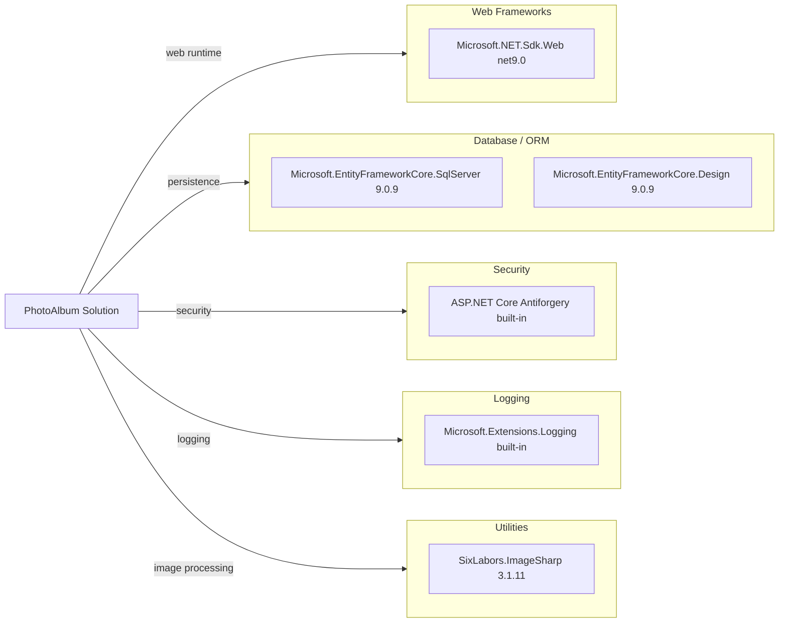

# Dependency Map

PhotoAlbum declares a small dependency surface across web, ORM, image processing, and testing concerns (9 direct NuGet package references in total across app and test projects).

## Dependencies

### Dependency Summary

| Category | Count | Key Libraries | Notes |
|---|---:|---|---|
| Web Frameworks | 1 | ASP.NET Core Web SDK | Razor Pages hosting runtime |
| Database / ORM | 2 | EF Core SqlServer, EF Core Design | SQL Server persistence and migrations |
| Security | 1 | ASP.NET Core antiforgery (framework) | Form token validation in Razor Pages |
| Logging | 1 | Microsoft logging abstractions (framework) | Structured app logging |
| Utilities | 1 | SixLabors.ImageSharp | Reads image dimensions during upload |

### Version & Compatibility Risks

The solution currently targets `net9.0`, which is newer than the repository’s original baseline but still has a future migration path to `net10.0`. EF Core and ASP.NET packages are aligned at 9.0.x, reducing version skew risk; migration effort is mainly framework-target validation and API compatibility checks.

### Notable Observations

- Core app dependencies are minimal and focused, which should reduce upgrade risk.
- EF Core Design is marked `PrivateAssets=all`, avoiding runtime deployment bloat.
- No external caching, messaging, or observability packages are declared.
- Test-only packages are isolated to the test project and excluded from runtime dependency graph.

## Test Dependencies

| Framework | Version | Notes |
|---|---|---|
| xUnit | 2.9.2 | Unit/integration test framework |
| xunit.runner.visualstudio | 2.8.2 | Visual Studio test runner integration |
| Microsoft.NET.Test.Sdk | 17.12.0 | Test host/runtime integration |
| coverlet.collector | 6.0.2 | Code coverage collection |
| Microsoft.AspNetCore.Mvc.Testing | 9.0.9 | In-memory web host for integration tests |
| Microsoft.EntityFrameworkCore.InMemory | 9.0.9 | Test-time EF provider |

Total test-scope dependencies: 6

The test stack is current and aligned with net9.0. Integration testing support is present via `Microsoft.AspNetCore.Mvc.Testing`.
